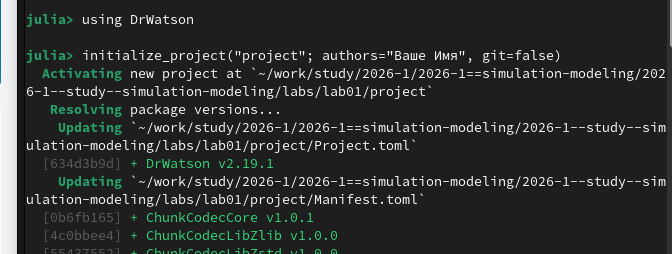
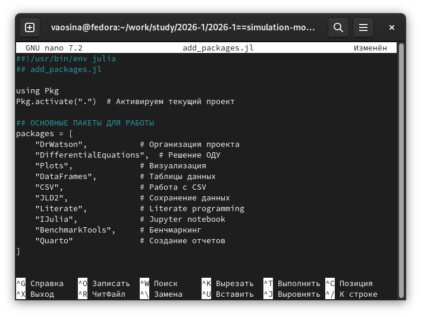
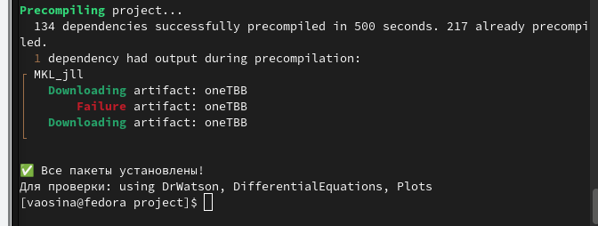
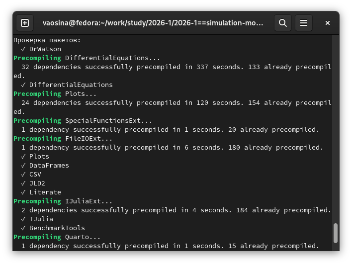
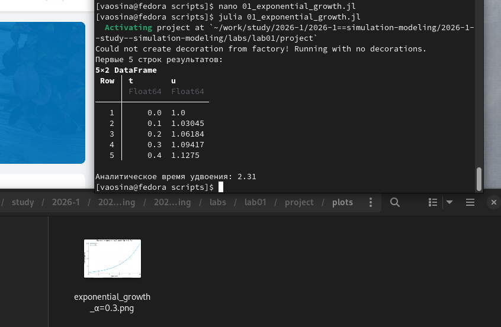
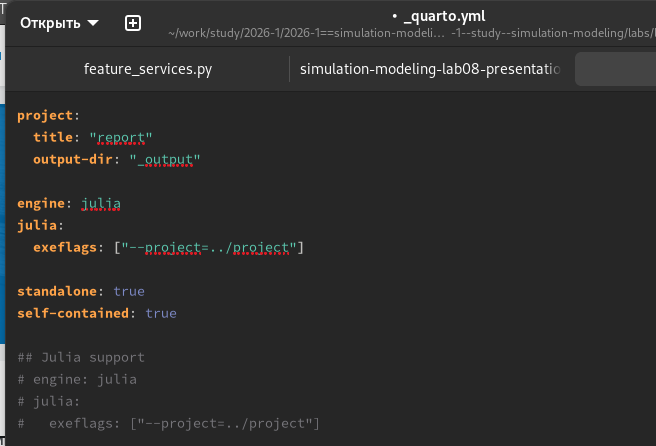
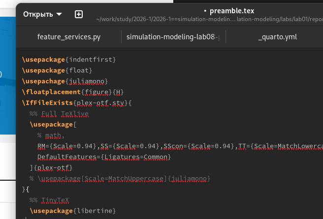
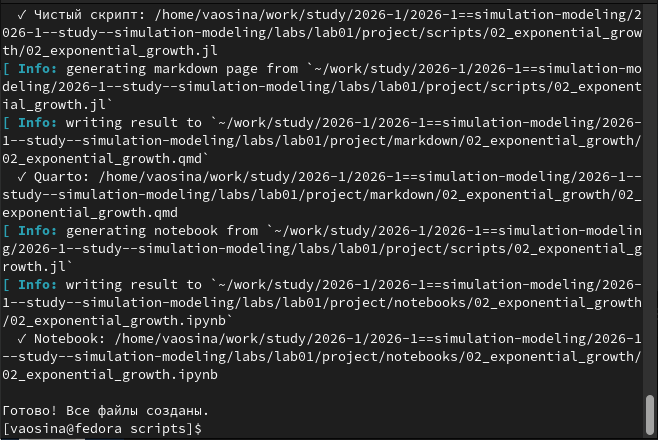
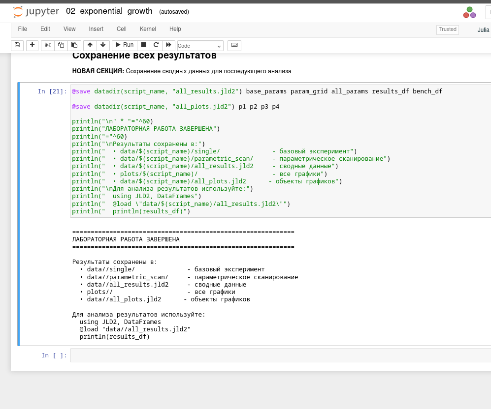

---
## Author
author:
  name: Осина Виктория Александровна
  email: 1132236006rudn.ru
  affiliation:
    - name: Российский университет дружбы народов
      country: Российская Федерация
      postal-code: 117198
      city: Москва
      address: ул. Орджоникидзе д. 3
      
## Title
title: "Презентация по лабораторной работе №1"
subtitle: "Подготовка стенда"
license: CC BY
date: today
date-format: "2026-05-30" 

format: 
  revealjs:  # для HTML презентации
    theme: beige
    slide-number: true
  beamer:    # для PDF презентации
    theme: metropolis
---
## Докладчик

:::::::::::::: {.columns align=center}
::: {.column width="70%"}

   Осина Виктория Александровна
   
   студент
   
   Российский университет дружбы народов им. П. Лумумбы
   
   [1132236006@rudn.ru]
   
   <https://urocean.github.io>

:::
::: {.column width="30%"}

:::
::::::::::::::

## Актуальность

* Актуальность первой лабораторной работы в том, чтобы сразу настроить удобное рабочее окружение для всего курса: ввести чёткие правила оформления изменений в коде, научиться выполнять коды с моделью и автоматически превращать расчёты в читаемую документацию. Без этого будет сложно поддерживать порядок, повторять эксперименты и оформлять отчёты.

## Цель работы

- Установка необходимых пакетов
- Создание репозитория
- Настройка git
- Создание рабочего пространства 
- Создание проекта DrWatson
- Выполнение задания

# Выполнение лабораторной работы

## Инициализирую проект. ([рис. @fig-001]).

{#fig-001 width=70%}

## Создаю файл со скриптом для добавления необходимых пакетов. ([рис. @fig-002]).

{#fig-002 width=70%}

## Скрипт успешно выполнен, все пакеты установлены. ([рис. @fig-004]).

{#fig-004 width=70%}

## Запускаем скрипт для проверки установки пакетов. ([рис. @fig-006]).

{#fig-006 width=70%}

## Выполняем скрипт, на выходе получили датафрейм с первыми 5 строками результатов и график [рис. @fig-008]).

{#fig-008 width=70%}

## Изменим файл scripts/01_exponential_growth.jl ([рис. @fig-009]).

{#fig-009 width=70%}

## Выполняем скрипт, на выходе получили датафрейм с первыми 5 строками результатов и график. ([рис. @fig-010]).

{#fig-010 width=70%}

## Создаю скрипт для генерации производных форматов scripts/tangle.jl  ([рис. @fig-011]).

{#fig-011 width=70%}

## Создаю производные форматы для scripts/01_exponential_growth.jl.([рис. @fig-012]).

{#fig-012 width=70%}

## Выполняю Jupyter-ноутбук notebooks/01_exponential_growth/01_exponential_growth.ipynb. [рис. @fig-013]).

{#fig-013 width=70%}

## В каталоге отчёта в файл _quarto.yml включаю поддержку кода julia. ([рис. @fig-014]).

{#fig-014 width=70%}

## В преамбуле preamble.tex подключаю пакет juliamono ([рис. @fig-015]).

{#fig-015 width=70%}

## Реализую модель с параметрами ([рис. @fig-016])

{#fig-016 width=70%}

## Вывод программы 02_exponential_growth.jl ([рис. @fig-018])

{#fig-018 width=70%}

## Создаю производные форматы для scripts/02_exponential_growth.jl.([рис. @fig-019]).

{#fig-019 width=70%}

##Выполняю Jupyter-ноутбук notebooks/02_exponential_growth/02_exponential_growth.ipynb. [рис. @fig-020]).

{#fig-020 width=70%}

## Выводы

- Установили необходимые пакеты
- Создали репозиторий
- Настроили git
- Создали рабочее пространство 
- Создали проект DrWatson
- Выполнили задания
