---
## Author
author:
  name: Осина Виктория Александровна
  email: 1132236006rudn.ru
  affiliation:
    - name: Российский университет дружбы народов
      country: Российская Федерация
      postal-code: 117198
      city: Москва
      address: ул. Орджоникидзе д. 3

## Title
title: "Отчёт по лабораторной работе №1"
subtitle: "Подготовка стенда"
license: "CC BY"

execute:
  eval: false
---

# Цель работы

- Установка необходимых пакетов
- Создание репозитория
- Настройка git
- Создание рабочего пространства 
- Создание проекта DrWatson
- Выполнение задания

# Задание

   * Создать рабочий каталог для кода.
   * Установить необходимые пакеты.
   * Выполнить предложенный код.
   * Преобразовать код в литературный стиль.
   * Сгенерировать из литературного кода:
       - чистый код;
       - jupyter notebook;
       - документацию в формате Quarto.
   * Выполнить код из jupyter notebook.
   * Интегрировать документацию в формате Quarto в отчёт.
   * Добавить в код в литературном стиле вычисление для набора параметров.
   * Сгенерировать из литературного кода с параметрами:
       - чистый код;
       - jupyter notebook;
       - документацию в формате Quarto.
   * Выполнить код из jupyter notebook с параметрами.
   * Интегрировать документацию с параметрами в формате Quarto в отчёт.

# Теоретическое введение

    Системы контроля версий (Version Control System, VCS) применяются при работе нескольких человек над одним проектом. Обычно основное дерево проекта хранится в локальном или удалённом репозитории, к которому настроен доступ для участников проекта. При внесении изменений в содержание проекта система контроля версий позволяет их фиксировать, совмещать изменения, произведённые разными участниками проекта, производить откат к любой более ранней версии проекта, если это требуется.
    В классических системах контроля версий используется централизованная модель, предполагающая наличие единого репозитория для хранения файлов. Выполнение большинства функций по управлению версиями осуществляется специальным сервером. Участник проекта (пользователь) перед началом работы посредством определённых команд получает нужную ему версию файлов. После внесения изменений, пользователь размещает новую версию в хранилище. При этом предыдущие версии не удаляются из центрального хранилища и к ним можно вернуться в любой момент. Сервер может сохранять не полную версию изменённых файлов, а производить так называемую дельта-компрессию — сохранять только изменения между последовательными версиями, что позволяет уменьшить объём хранимых данных.
    Системы контроля версий поддерживают возможность отслеживания и разрешения конфликтов, которые могут возникнуть при работе нескольких человек над одним файлом. Можно объединить (слить) изменения, сделанные разными участниками (автоматически или вручную), вручную выбрать нужную версию, отменить изменения вовсе или заблокировать файлы для изменения. В зависимости от настроек блокировка не позволяет другим пользователям получить рабочую копию или препятствует изменению рабочей копии файла средствами файловой системы ОС, обеспечивая таким образом, привилегированный доступ только одному пользователю, работающему с файлом.
    Системы контроля версий также могут обеспечивать дополнительные, более гибкие функциональные возможности. Например, они могут поддерживать работу с несколькими версиями одного файла, сохраняя общую историю изменений до точки ветвления версий и собственные истории изменений каждой ветви. Кроме того, обычно доступна информация о том, кто из участников, когда и какие изменения вносил. Обычно такого рода информация хранится в журнале изменений, доступ к которому можно ограничить.
    В отличие от классических, в распределённых системах контроля версий центральный репозиторий не является обязательным.
    Среди классических VCS наиболее известны CVS, Subversion, а среди распределённых — Git, Bazaar, Mercurial. Принципы их работы схожи, отличаются они в основном синтаксисом используемых в работе команд.

# Выполнение лабораторной работы

Инициализирую проект. ([рис. @fig-001]).

{#fig-001 width=70%}

Создаю файл со скриптом для добавления необходимых пакетов. ([рис. @fig-002]).

{#fig-002 width=70%}

Запускаю скрипт и жду установки всех пакетов. ([рис. @fig-003]).

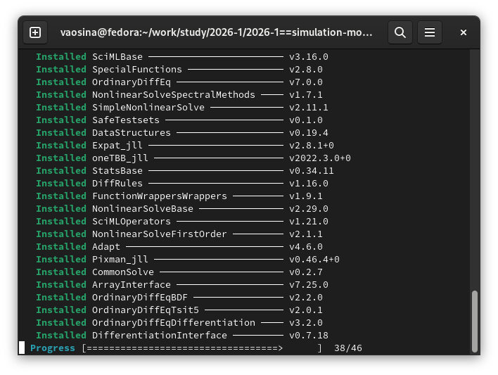{#fig-003 width=70%}

Скрипт успешно выполнен, все пакеты установлены. ([рис. @fig-004]).

{#fig-004 width=70%}

Создаём тестовый скрипт scripts/test_setup.jl.([рис. @fig-005]).

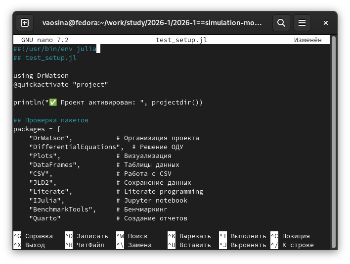{#fig-005 width=70%}

Запускаем скрипт для проверки установки пакетов. ([рис. @fig-006]).

{#fig-006 width=70%}

Создаём скрипт модели экспоненциального роста scripts/01_exponential_growth.jl ([рис. @fig-007]).

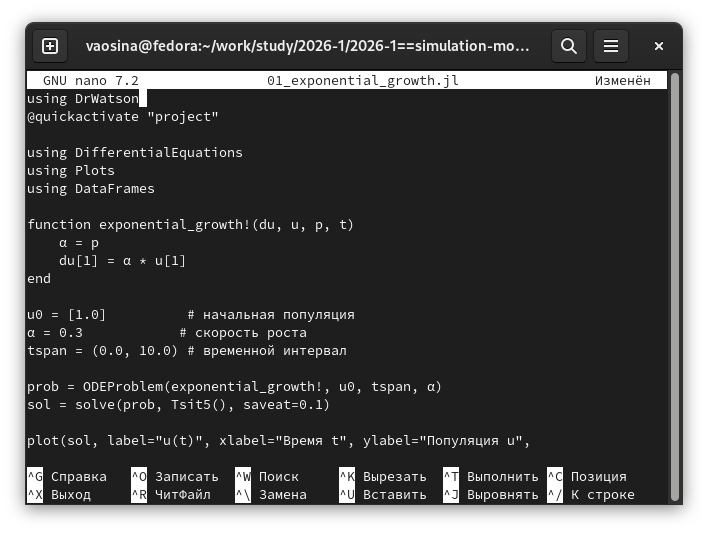{#fig-007 width=70%}

Выполняем скрипт, на выходе получили датафрейм с первыми 5 строками результатов и график [рис. @fig-008]).

{#fig-008 width=70%}

Изменим файл scripts/01_exponential_growth.jl ([рис. @fig-009]).

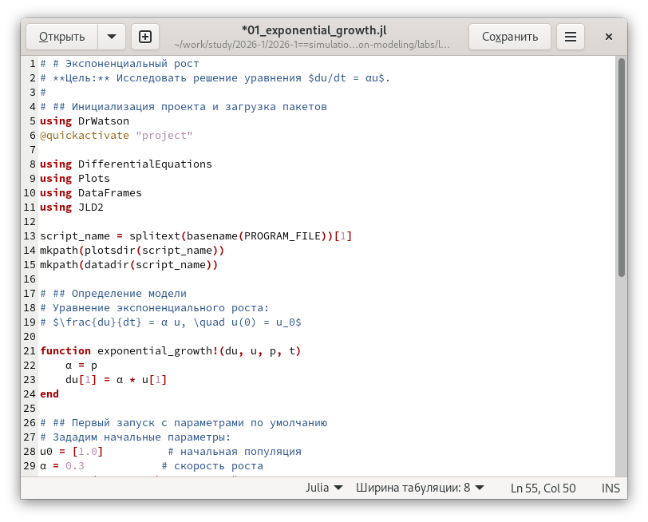{#fig-009 width=70%}



Выполняем скрипт, на выходе получили датафрейм с первыми 5 строками результатов и график. ([рис. @fig-010]).

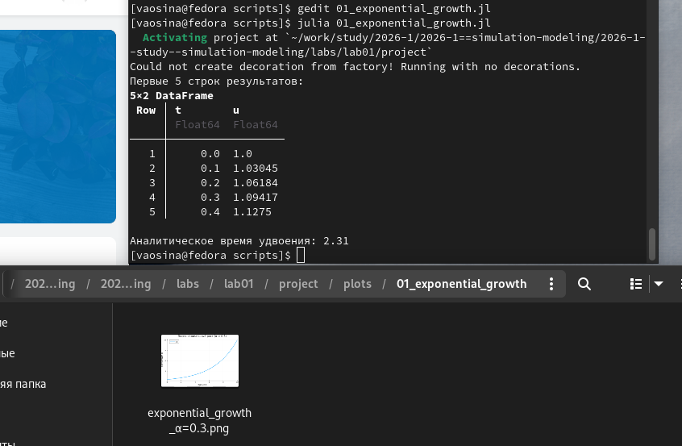{#fig-010 width=70%}

Создаю скрипт для генерации производных форматов scripts/tangle.jl  ([рис. @fig-011]).

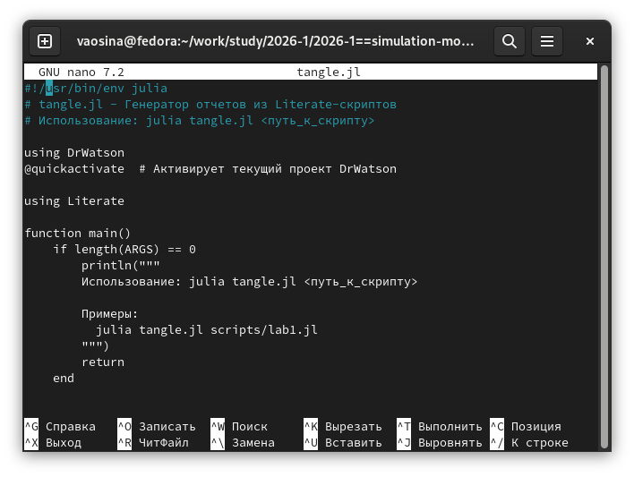{#fig-011 width=70%}

Создаю производные форматы для scripts/01_exponential_growth.jl.([рис. @fig-012]).

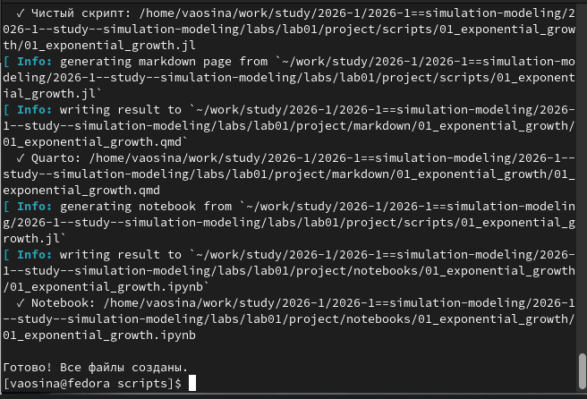{#fig-012 width=70%}

Выполняю Jupyter-ноутбук notebooks/01_exponential_growth/01_exponential_growth.ipynb. [рис. @fig-013]).

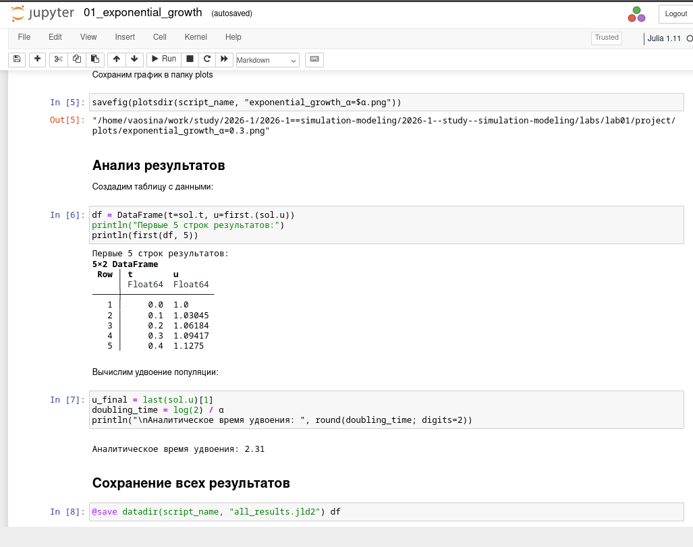{#fig-013 width=70%}

В каталоге отчёта в файл _quarto.yml включаю поддержку кода julia. ([рис. @fig-014]).

{#fig-014 width=70%}

В преамбуле preamble.tex подключаю пакет juliamono ([рис. @fig-015]).

{#fig-015 width=70%}

Реализую модель с параметрами ([рис. @fig-016])

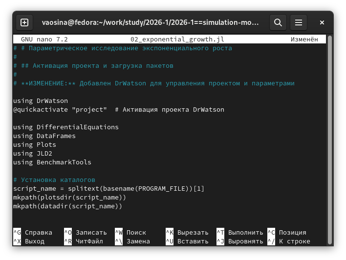{#fig-016 width=70%}

Выполняю программу 02_exponential_growth.jl ([рис. @fig-017])

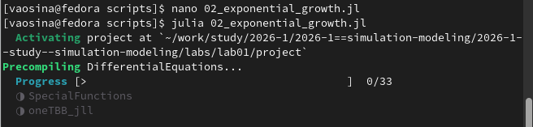{#fig-017 width=70%}

Вывод программы 02_exponential_growth.jl ([рис. @fig-018])

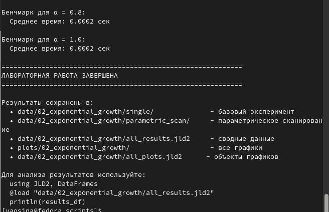{#fig-018 width=70%}

Создаю производные форматы для scripts/02_exponential_growth.jl.([рис. @fig-019]).

{#fig-019 width=70%}

Выполняю Jupyter-ноутбук notebooks/02_exponential_growth/02_exponential_growth.ipynb. [рис. @fig-020]).

{#fig-020 width=70%}



# Выводы

- Установили необходимые пакеты
- Создали репозиторий
- Настроили git
- Создали рабочее пространство 
- Создали проект DrWatson
- Выполнили задания

# Список литературы

1. [ТУИС](https://esystem.rudn.ru/pluginfile.php/3094278/mod_resource/content/7/simulation-modeling-lab.pdf)
