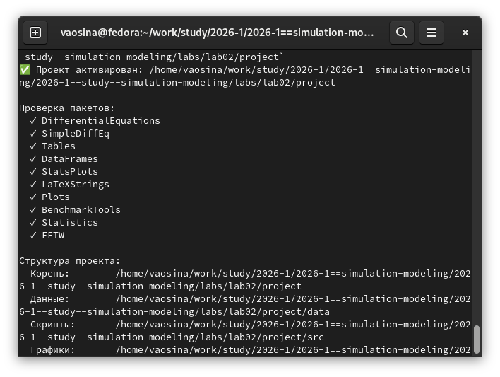
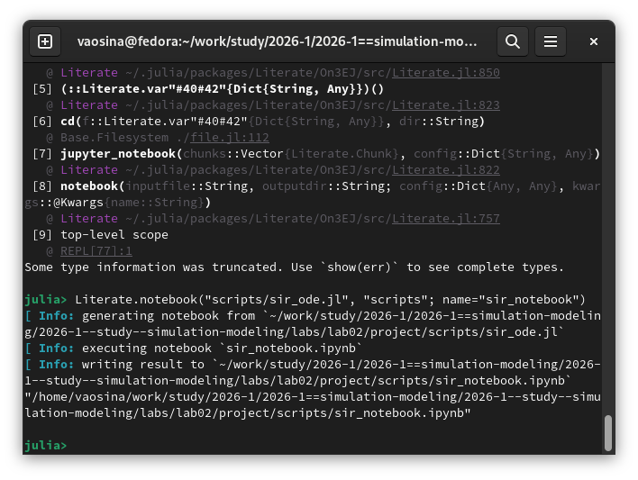
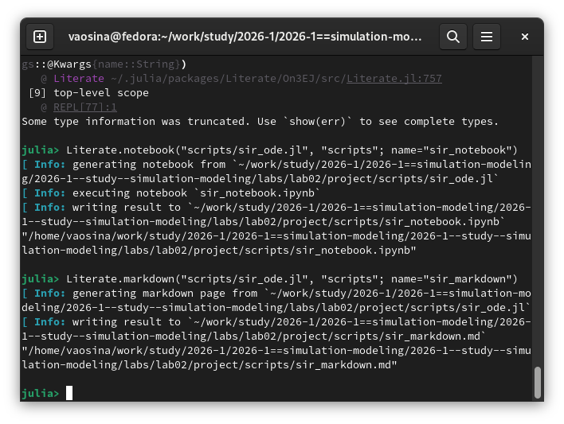
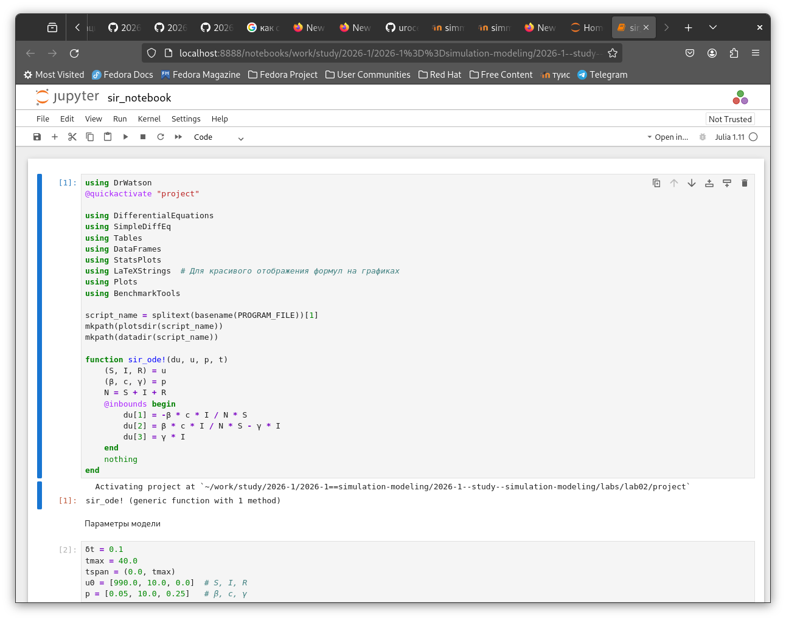

---
## Author
author:
  name: Осина Виктория Александровна
  degrees: DSc
  orcid: 0000-0002-0877-7063
  email: 1132236006rudn.ru
  affiliation:
    - name: Российский университет дружбы народов
      country: Российская Федерация
      postal-code: 117198
      city: Москва
      address: ул. Орджоникидзе д. 3
      
## Title
title: "Презентация по лабораторной работе №2"
subtitle: "Основные модели"
license: CC BY
date: today
date-format: "2026-03-07" 

format: 
  revealjs:  # для HTML презентации
    theme: beige
    slide-number: true
  beamer:    # для PDF презентации
    theme: metropolis
---
## Докладчик

:::::::::::::: {.columns align=center}
::: {.column width="70%"}

   Осина Виктория Александровна
   
   студент
   
   Российский университет дружбы народов им. П. Лумумбы
   
   [1132236006@rudn.ru]
   
   <https://urocean.github.io>

:::
::: {.column width="30%"}

:::
::::::::::::::

## Актуальность

Важность экология и эпидемиологии в настоящее время

Удобство для пользователей генерировать новые форматы файлов

## Цели и задачи

Ознакомиться с моделями SIR и Лотки–Вольтерры

Научиться генерировать новые форматы из литературного кода

## Установка необходимых пакетов

{#fig-004 width=70%}

{#fig-006 width=70%}

## Создание файлов с кодами

{#fig-007 width=70%}

{#fig-010 width=70%}

## Генерация новых файлов
### Генерация из литературного кода чистый код, jupiter notebook и документацию в формате Quarto

{#fig-014 width=70%}

{#fig-015 width=70%}

{#fig-016 width=70%}

## Просмотр и выполнение кода в Jupiter Notebook 

{#fig-019 width=70%}

## Выводы 

- Ознакомились с основными моделями: модель SIR и модель Лотки–Вольтерры,
- Научились генерировать из литературного кода чистый код, jupiter notebook и документацию в формате Quarto
