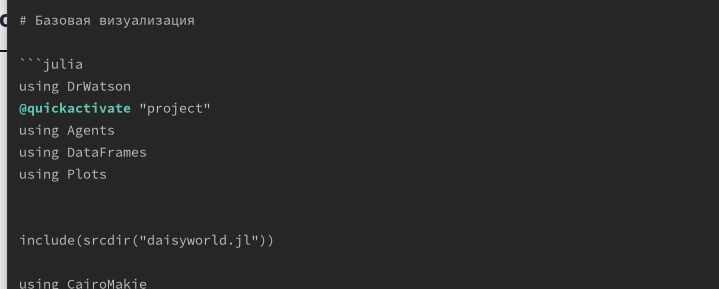
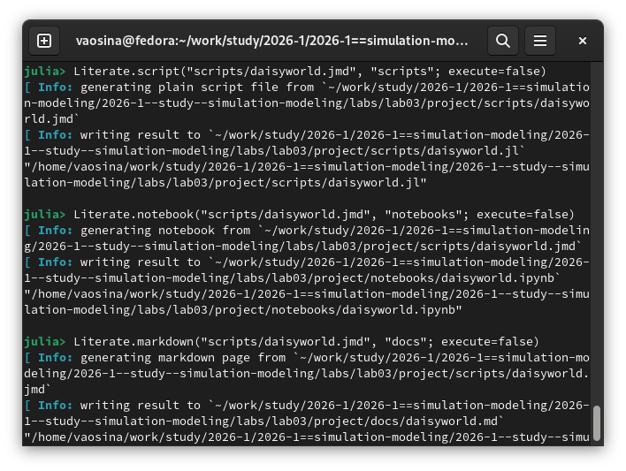
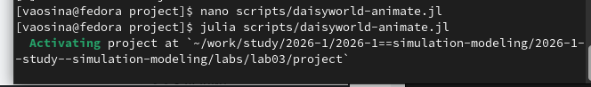

---
## Author
author:
  name: Осина Виктория Александровна
  degrees: DSc
  orcid: 0000-0002-0877-7063
  email: 1132236006rudn.ru
  affiliation:
    - name: Российский университет дружбы народов
      country: Российская Федерация
      postal-code: 117198
      city: Москва
      address: ул. Орджоникидзе д. 3
      
## Title
title: "Презентация по лабораторной работе №3"
subtitle: "Агентное моделирование"
license: CC BY
date: today
date-format: "2026-03-21" 

format: 
  revealjs:  # для HTML презентации
    theme: beige
    slide-number: true
  beamer:    # для PDF презентации
    theme: metropolis
---
## Докладчик

:::::::::::::: {.columns align=center}
::: {.column width="70%"}

   Осина Виктория Александровна
   
   студент
   
   Российский университет дружбы народов им. П. Лумумбы
   
   [1132236006@rudn.ru]
   
   <https://urocean.github.io>

:::
::: {.column width="30%"}

:::
::::::::::::::

## Актуальность

* Агентное моделирование применяется во многих важных сферах нашей жизни, таких как: экология, экономика, социология, политология и многих других.

* Данный подход обладает несколькими преимуществами: гибкость, учёт индивидуальных различий, адаптивность,  наглядность и исследование механизмов. 

## Цели и задачи

 - Ознакомиться с агентным моделированием.

 - Рассмотреть модель Daisyworld.

 - Закрепить навыки генерации новых форматов из литературного кода.

# Выполнение лабораторной работы. 
## Предварительно установили необходимые пакеты, создали нужную файловую структуру. После этого создадим файл src/daisyworld.jl. Здесь мы определим тип агента и функции шага модели.

{#fig-003 width=70%}

{#fig-004 width=70%}

## Преобразую код сначала в литературный стиль, затем генерирую из него такие форматы, как чистый код, notebook, markdown.

{#fig-005 width=70%}

##

{#fig-006 width=70%}

## Выполнение кода jupiter notebook.

{#fig-008 width=70%}

## Создаю визуализацию. В результате получаем файл с анимацией модели.

{#fig-009 width=70%}

{#fig-010 width=70%}

# Последующее выполнение лабораторной работы в точности повторяет все действия, о которых я уже рассказала, только уже с другими кодами, в том числе с добавлением подбора параметров модели.

## Выводы 

- Ознакомились с агентным моделированием.

- Рассмотрели модель Daisyworld.

- Закрепили навыки генерации новых форматов из литературного кода.
