---
## Author
author:
  name: Осина Виктория Александровна
  degrees: DSc
  orcid: 0000-0002-0877-7063
  email: 1132236006rudn.ru
  affiliation:
    - name: Российский университет дружбы народов
      country: Российская Федерация
      postal-code: 117198
      city: Москва
      address: ул. Орджоникидзе д. 3

## Title
title: "Отчёт по лабораторной работе №3"
subtitle: "Основные модели"
license: "CC BY"
---

# Цель работы

Ознакомиться с агентным подходом на примере модели Daisyworld.

# Задание

   * Создать рабочий каталог для кода.
   * Установить необходимые пакеты.
   * Выполнить предложенный код.
   * Преобразовать код в литературный стиль.
   * Сгенерировать из литературного кода:
       - чистый код;
       - jupyter notebook;
       - документацию в формате Quarto.
   * Выполнить код из jupyter notebook.
   * Интегрировать документацию в формате Quarto в отчёт.
   * Добавить в код в литературном стиле вычисление для набора параметров.
   * Сгенерировать из литературного кода с параметрами:
       - чистый код;
       - jupyter notebook;
       - документацию в формате Quarto.
   * Выполнить код из jupyter notebook с параметрами.
   * Интегрировать документацию с параметрами в формате Quarto в отчёт.

# Теоретическое введение

## Агентный подход

Агентный подход к имитационному моделированию (Agent-Based Modeling, ABM) — это метод исследования сложных систем, в котором поведение системы возникает из взаимодействия множества автономных сущностей, называемых агентами. Вместо того чтобы описывать систему глобальными уравнениями, мы моделируем каждую индивидуальную единицу и правила её поведения, а затем наблюдаем, какие коллективные паттерны появляются снизу вверх. Этот подход особенно полезен, когда поведение системы трудно предсказать из-за нелинейностей, гетерогенности участников или адаптивных стратегий.

## Модель Daisyworld

Модель Daisyworld, предложенная Джеймсом Лавлоком и Эндрю Уотсоном, иллюстрирует гипотезу Геи [2,3]. Гипотеза Геи рассматривает планету как единую, саморегулирующуюся систему, включающую как живые, так и неживые части.

# Выполнение лабораторной работы

Предварительно инициализирую проект ([рис. @fig-001]).

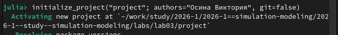{#fig-001 width=70%}

Создаю файл src/daisyworld.jl. Далее скопирую в него код из задания к лабораторной работе. Здесь мы определим тип агента и функции шага модели. ([рис. @fig-002]).

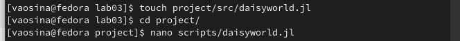{#fig-002 width=70%}

Запускаю код. ([рис. @fig-003]).

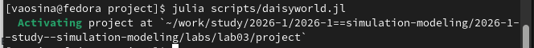{#fig-003 width=70%}

Результат выполнения. Создались 3 графика.([рис. @fig-004]).

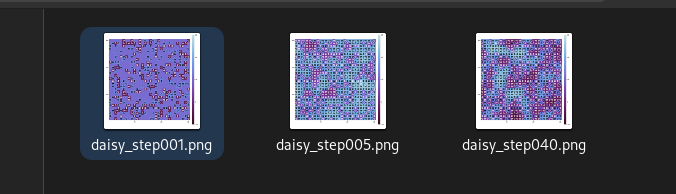{#fig-004 width=70%}

Преобразовала код в литературный стиль, добавив комментарий и задав формат файла jmd. ([рис. @fig-005]).

{#fig-005 width=70%}

Генерирую из литературного кода чистый код, jupyter notebook и документацию в формате Quarto. Сначала генерирую файл в формате markdown, а затем просто переименую из md в qmd([рис. @fig-006]).

{#fig-006 width=70%}

Выполняю код в jupiter notebook, код выполнен корректно и также создал три графика, перезаписав старые. ([рис. @fig-008]).

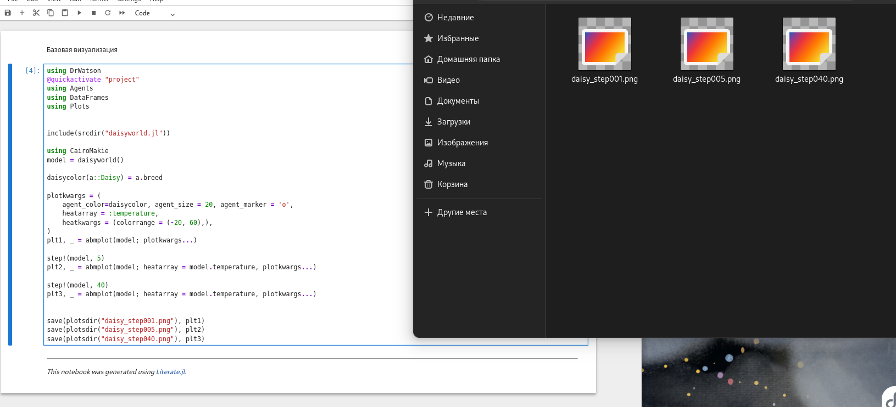{#fig-008 width=70%}

Создадим визуализацию не отдельных моментов, а видео эволюции модели. Для этого создаю файл daisyworld-animate.jl, копирую в него код из задания к лабораторной работе и выполняю код. ([рис. @fig-009]).

{#fig-009 width=70%}

Видим, что создался файл с анимацией в формате mp4. ([рис. @fig-010]).

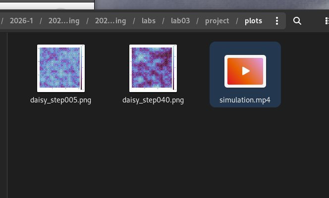{#fig-010 width=70%}

Создаю файл daisyworld-count.jl. Далее скопирую в него код из задания к лабораторной работе. При помощи данного кода строится график изменения числа маргариток в зависимости от модельного времени. Запускаю код. ([рис. @fig-011]).

{#fig-010 width=70%}

Преобразовала код в литературный стиль, добавив комментарий и задав формат файла jmd. Затем генерирую из литературного кода чистый код, jupyter notebook и документацию в формате Quarto. Сначала генерирую файл в формате markdown, а затем просто переименую из md в qmd([рис. @fig-012]).

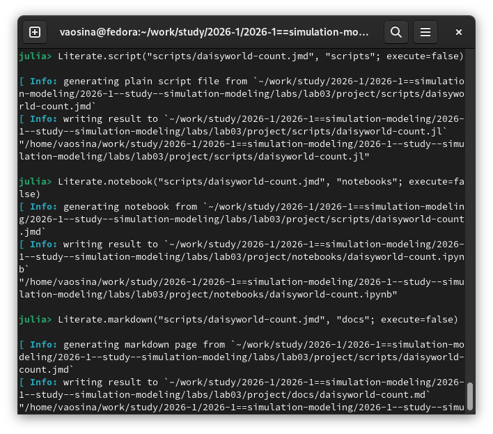{#fig-012 width=70%}

Выполняю код в jupiter notebook, код выполнен корректно и создал график. ([рис. @fig-013]).

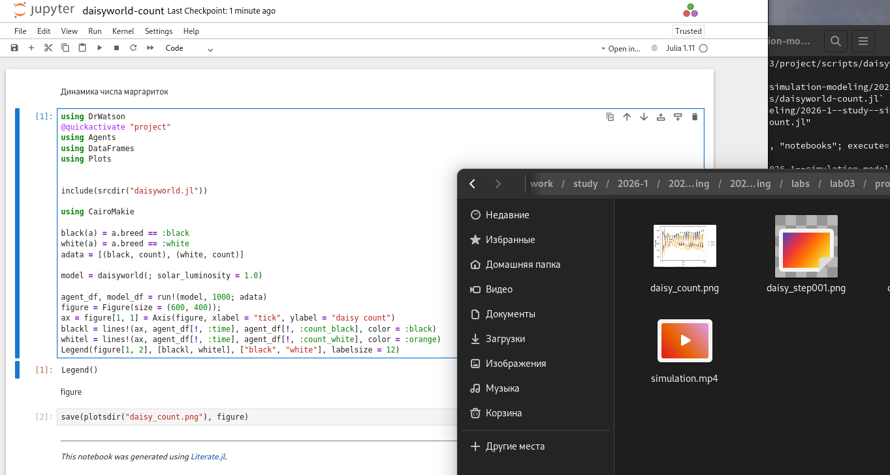{#fig-013 width=70%}

Аналогично повторяю все то же самое для daisyworld-luminosity.jl (Построение комплексного графика изменения числа маргариток, температуры, альбедо в зависимости от модельного времени), а также для тех же самых файлов, только с использованием подбора различных параметров модели.

Для daisyworld-luminosity.jl. ([рис. @fig-014]).

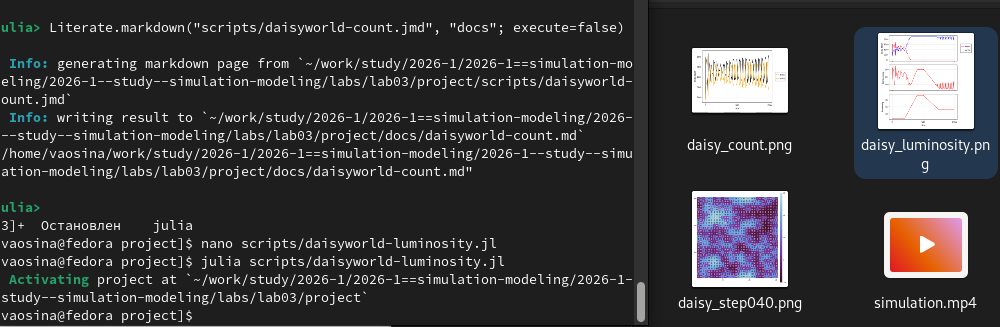{#fig-014 width=70%}

Генерация из литературного кода. ([рис. @fig-015]).

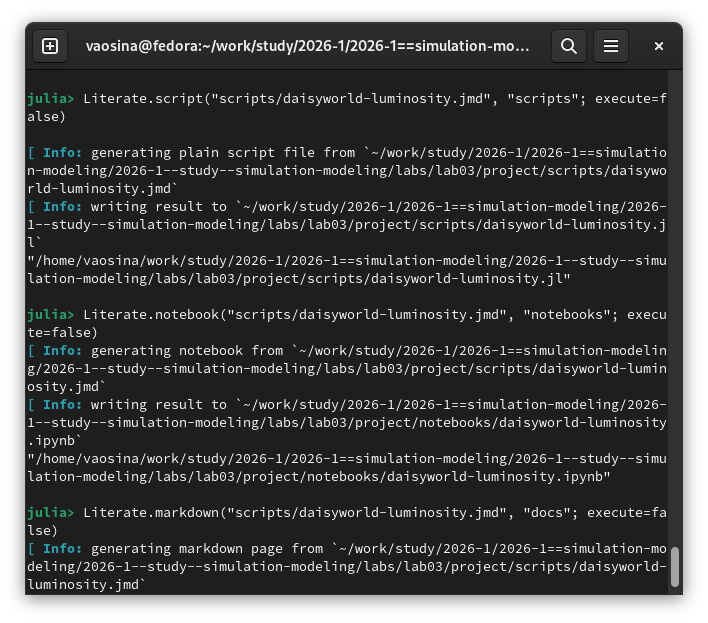{#fig-015 width=70%}

Выполняю код в jupiter notebook. ([рис. @fig-016]).

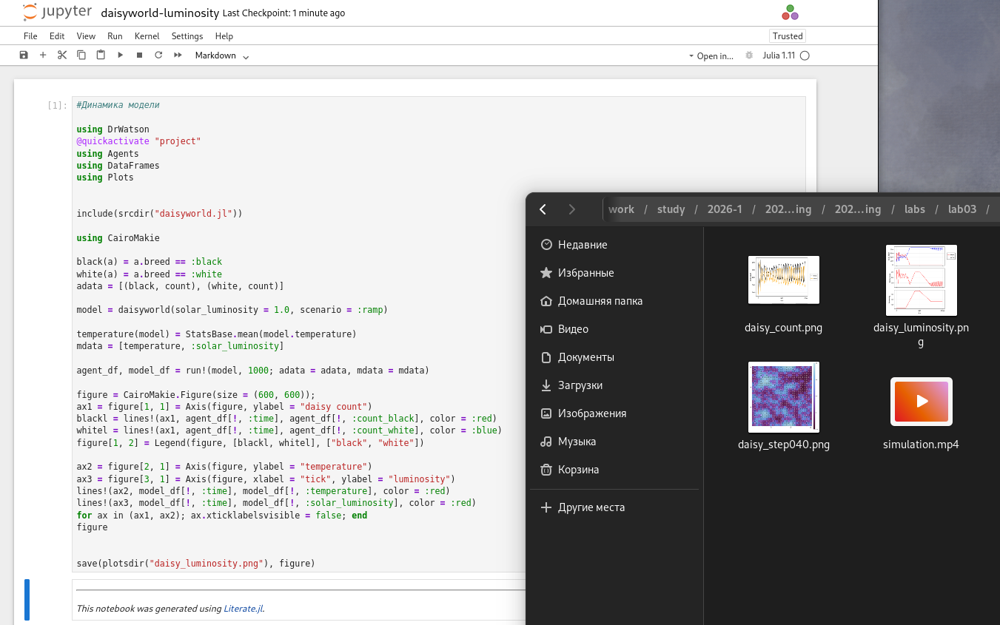{#fig-016 width=70%}

Для daisyworld__param.jl. ([рис. @fig-017]).

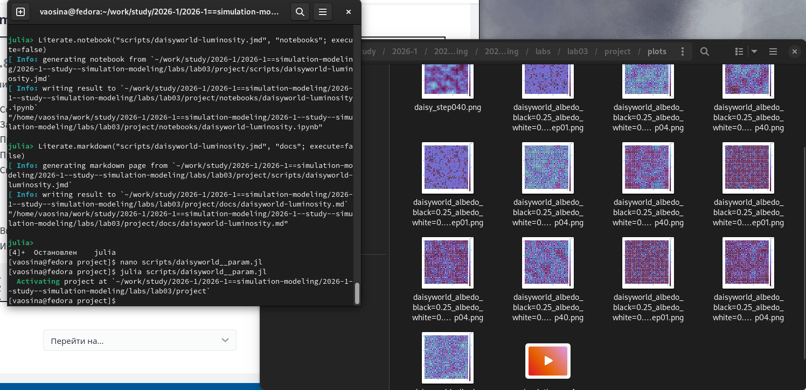{#fig-017 width=70%}

Генерация из литературного кода. ([рис. @fig-018]).

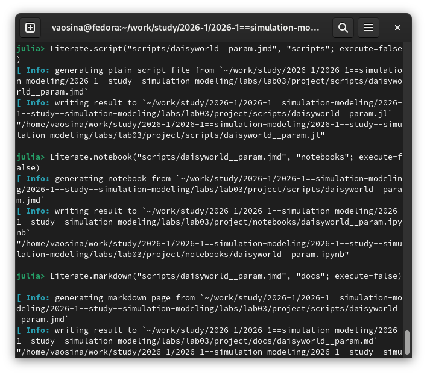{#fig-018 width=70%}

Выполняю код в jupiter notebook. ([рис. @fig-019]).

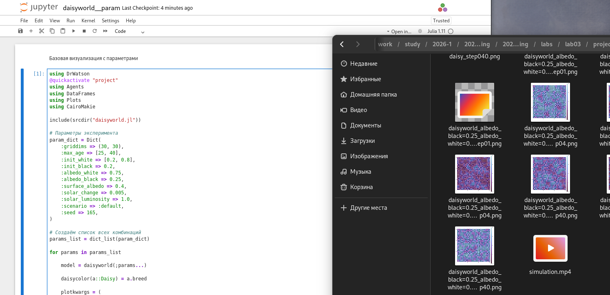{#fig-019 width=70%}

Для daisyworld-count__param.jl. ([рис. @fig-020]).

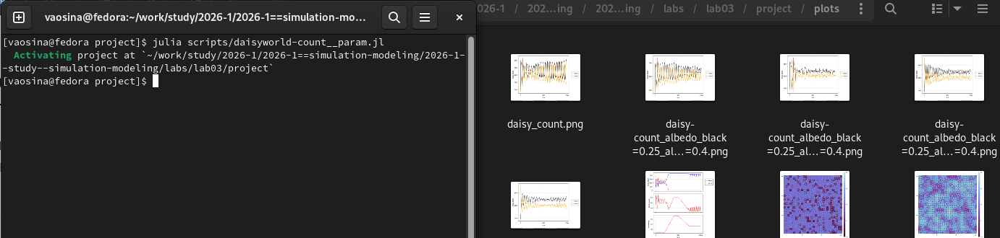{#fig-020 width=70%}

Генерация из литературного кода. ([рис. @fig-021]).

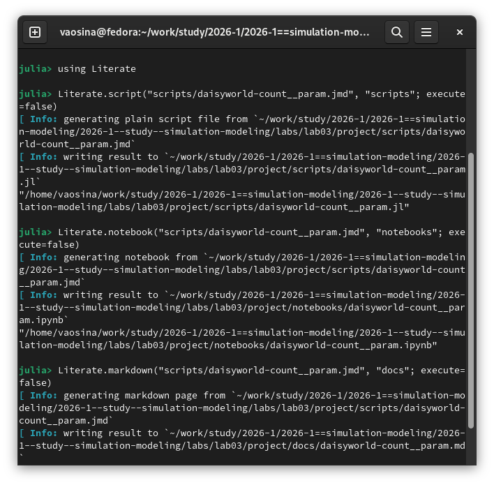{#fig-021 width=70%}

Выполняю код в jupiter notebook. ([рис. @fig-022]).

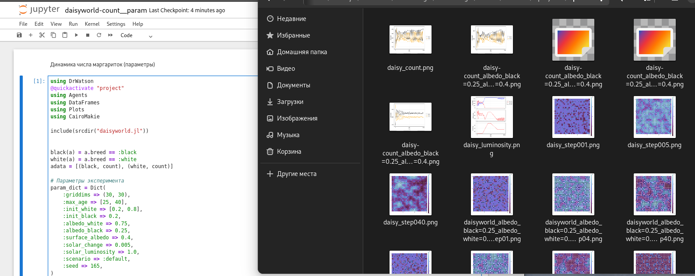{#fig-022 width=70%}

Для daisyworld-luminosity__param.jl. ([рис. @fig-023]).

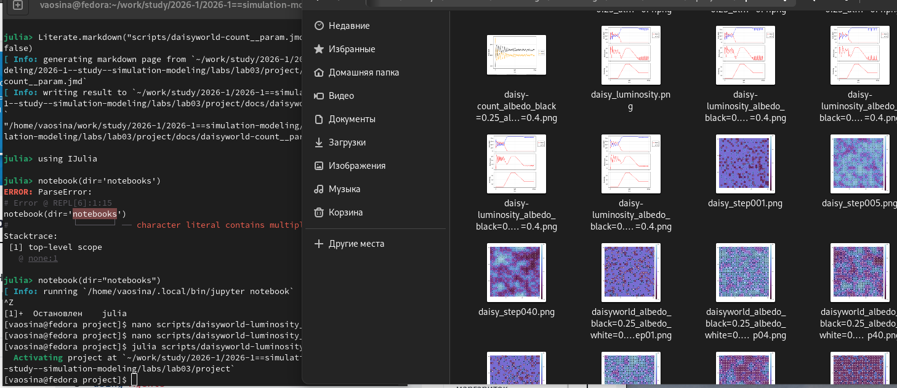{#fig-023 width=70%}

Генерация из литературного кода. ([рис. @fig-024]).

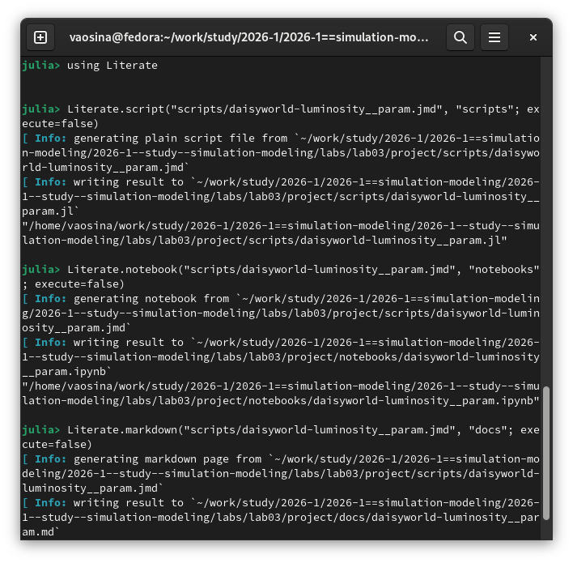{#fig-024 width=70%}

Выполняю код в jupiter notebook. ([рис. @fig-025]).

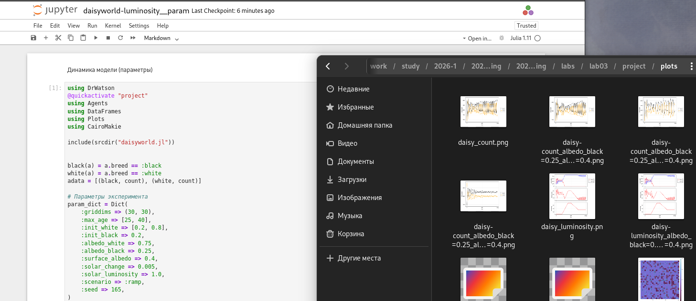{#fig-025 width=70%}

# Выводы

Ознакомились с агентным моделированием на примере модели с маргаритками, а также закрепили навыки генерации из литературного кода чистый код, jupiter notebook и документацию в формате Quarto.

# Список литературы{.unnumbered}

::: {#refs}
:::
