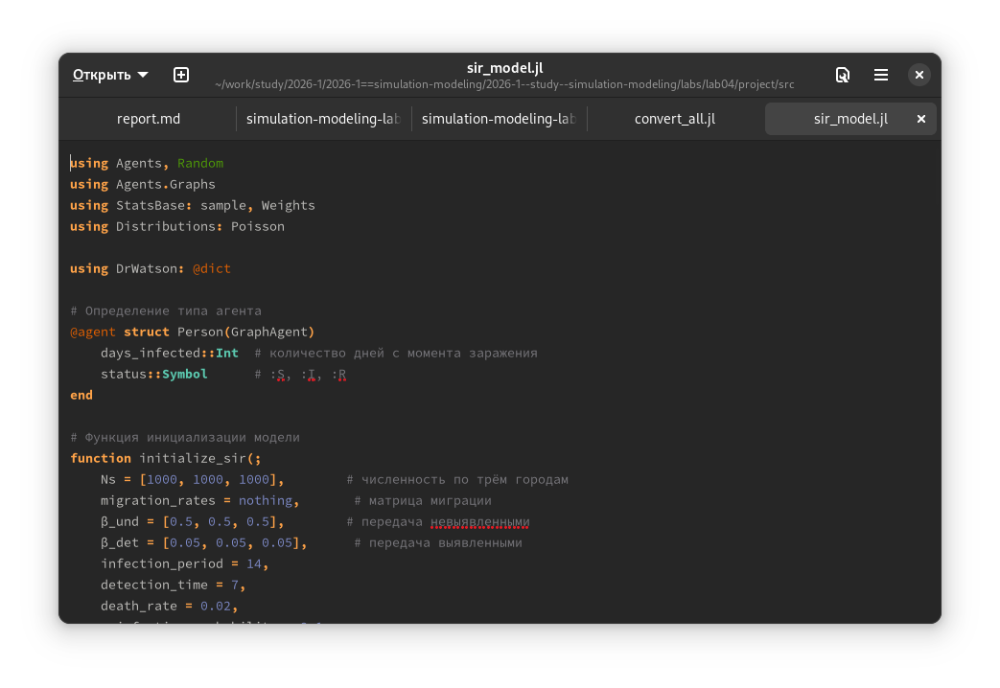
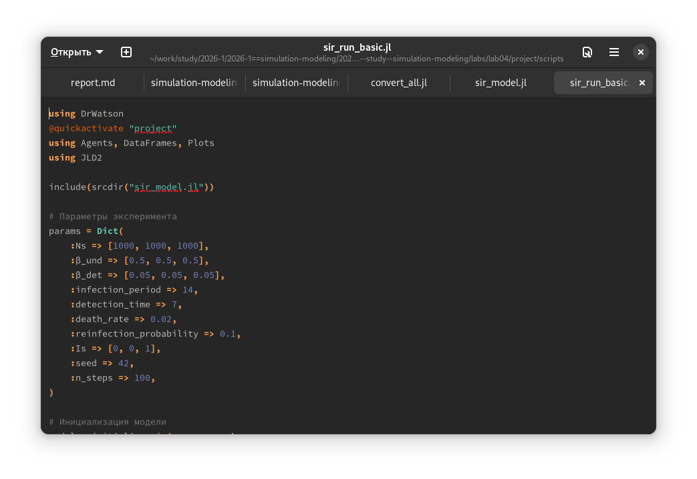
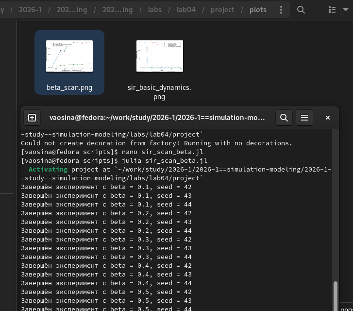
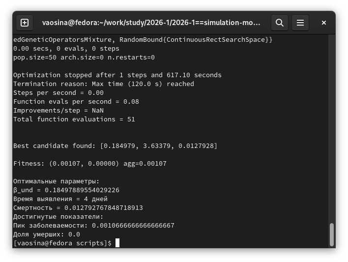
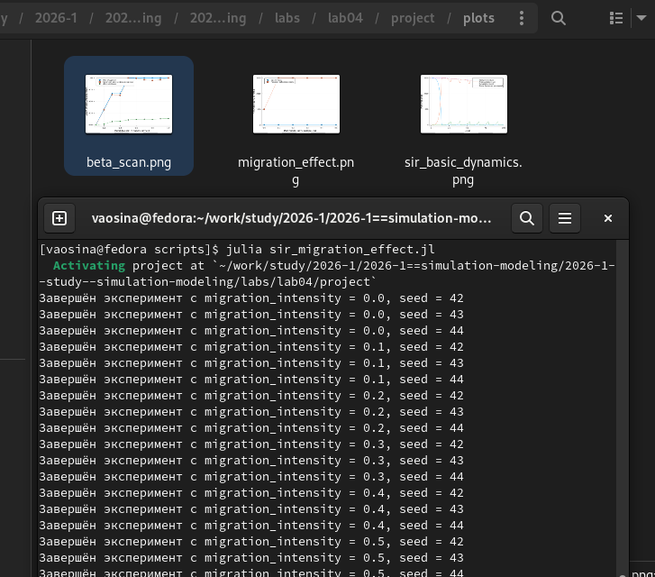
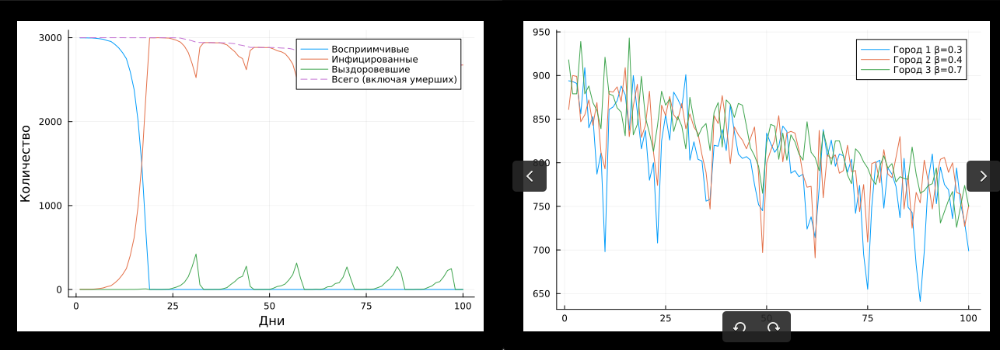
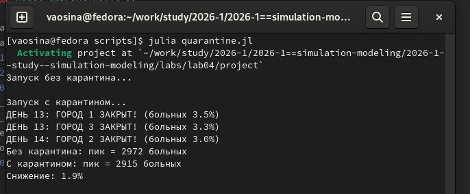
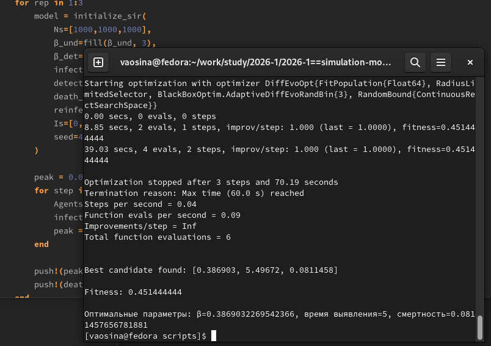
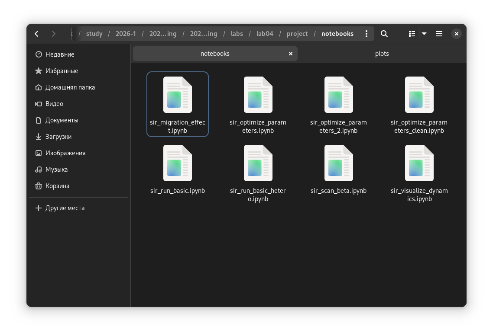

---
## Author
author:
  name: Осина Виктория Александровна
  degrees: DSc
  orcid: 0000-0002-0877-7063
  email: 1132236006rudn.ru
  affiliation:
    - name: Российский университет дружбы народов
      country: Российская Федерация
      postal-code: 117198
      city: Москва
      address: ул. Орджоникидзе д. 3
      
## Title
title: "Презентация по лабораторной работе №4"
subtitle: "Эпидемиологическая модель SIR"
license: CC BY
date: today
date-format: "2026-04-04" 

format: 
  revealjs:  # для HTML презентации
    theme: beige
    slide-number: true
  beamer:    # для PDF презентации
    theme: metropolis
---
## Докладчик

:::::::::::::: {.columns align=center}
::: {.column width="70%"}

   Осина Виктория Александровна
   
   студент
   
   Российский университет дружбы народов им. П. Лумумбы
   
   [1132236006@rudn.ru]
   
   <https://urocean.github.io>

:::
::: {.column width="30%"}

:::
::::::::::::::

## Актуальность

* В отличие от классической модели на дифференциальных уравнениях, агентный подход позволит учесть индивидуальные характеристики, пространственную структуру и стохастичность процессов.

* Эпидемиологическая модель очень важна для нас, т.к. болезни существовали всегда и то, что мы можем смоделировать поведение болезни, очень сильно облегчает нам жизнь.

## Цели и задачи

 - Ознакомиться с агентным моделированием, а именно эпидемиологической моделью SIR.

 - Провести оптимизацию параметров.

 - Закрепить навыки генерации новых форматов из литературного кода.

# Выполнение лабораторной работы. 
## Созданию файл с кодом модели. ([рис. @fig-002]).

{#fig-002 width=70%}

## Создаю файл с кодом базового эксперимента.([рис. @fig-003]).

{#fig-003 width=70%}

## Аналогично создаю файл с кодом сканирования коэффициента заразности 
[рис. @fig-004]).

{#fig-004 width=70%}

## Выполняю многокритериальную оптимизацию параметров ([рис. @fig-006]).

{#fig-006 width=70%}

## Провожу исследование эффекта миграции ([рис. @fig-005]).

{#fig-005 width=70%}

## Создаю файл с кодом сводной визуализации результатов. ([рис. @fig-007]).

{#fig-007 width=70%}

# Выполнение дополнительных заданий

Базовое репродуктивное число R_0 = 0.5/(1/14) = 7.

## 2. Исследование порога 

Нашли минимальное значение β, при котором возникает эпидемия. ([рис. @fig-008]).

{#fig-008 width=70%}

## 3. Эффект гетерогенности
Задала разные значение заражаемости для разных городов. ([рис. @fig-009]).

{#fig-009 width=70%}

## 4. Миграция
Данное задание уже было нами выполнено ранее в ходе лабораторной работы.

## 5. Карантинные меры

Модифицировали модель так, чтобы была возможность закрытия города при превышении заболеваемости. ([рис. @fig-010]).

{#fig-010 width=70%}

## 6. Оптимизация

Нашли параметры, которые минимизируют общее число умерших при сохранении пика заболеваемости ниже 30%. ([рис. @fig-011]).

{#fig-011 width=70%}

# Генерация из литературного кода 

## Код, который я использую для генерации новых форматов из литературного кода ([рис. @fig-013]).

{#fig-013 width=70%}

## Результаты генерации: чистый код, jupyter notebook и документацию в формате Quarto. ([рис. @fig-014]), ([рис. @fig-015]), ([рис. @fig-016]).

{#fig-014 width=70%}

{#fig-015 width=70%}

{#fig-016 width=70%}

## Выводы 

- Ознакомились с моделью SIR,
- Исследовали, как интенсивность перемещения людей влияет на скорость распространения эпидемии,
- Провели многокритериальную оптимизацию параметров, визуализировали результаты.
