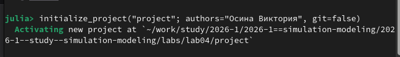
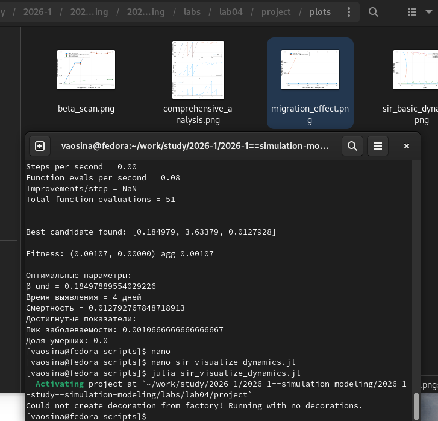
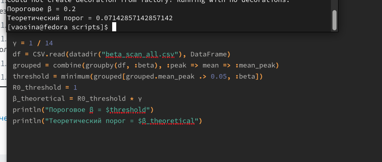
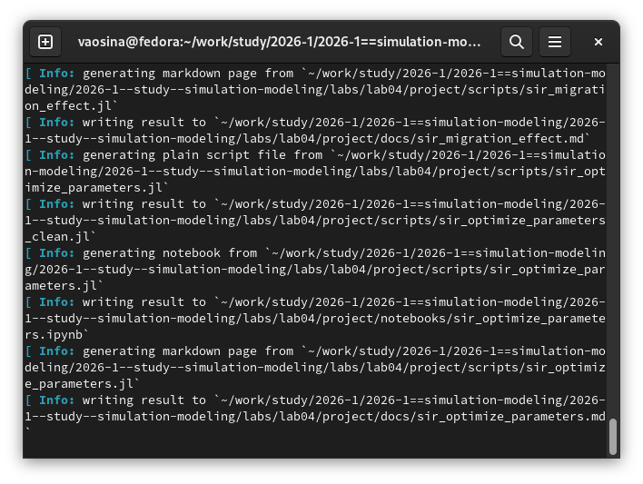
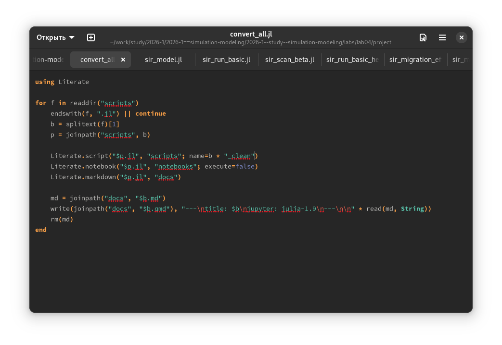

---
## Author
author:
  name: Осина Виктория Александровна
  degrees: DSc
  orcid: 0000-0002-0877-7063
  email: 1132236006rudn.ru
  affiliation:
    - name: Российский университет дружбы народов
      country: Российская Федерация
      postal-code: 117198
      city: Москва
      address: ул. Орджоникидзе д. 3

## Title
title: "Отчёт по лабораторной работе №4"
subtitle: "Реализация основных моделей в агентном подходе"
license: "CC BY"
---

# Цель работы

Ознакомиться с эпидемиологическая моделью SIR

# Задание

   * Создать рабочий каталог для кода.
   * Установить необходимые пакеты.
   * Выполнить предложенный код.
   * Преобразовать код в литературный стиль.
   * Сгенерировать из литературного кода:
       - чистый код;
       - jupyter notebook;
       - документацию в формате Quarto.
   * Выполнить код из jupyter notebook.
   * Интегрировать документацию в формате Quarto в отчёт.
   * Добавить в код в литературном стиле вычисление для набора параметров.
   * Сгенерировать из литературного кода с параметрами:
       - чистый код;
       - jupyter notebook;
       - документацию в формате Quarto.
   * Выполнить код из jupyter notebook с параметрами.
   * Интегрировать документацию с параметрами в формате Quarto в отчёт.

# Теоретическое введение

## SIR

Модель SIR, предложенная Кермаком и Маккендриком в 1927 году, описывает динамику эпидемии в популяции, разделённой на три группы:

* S — Susceptible (Восприимчивые): люди, которые не болели, не имеют иммунитета и могут заразиться.
* I — Infectious (Инфицированные/Заразные): люди, которые в данный момент больны и могут передавать инфекцию.

* R — Recovered (Выздоровевшие/Удаленные): люди, которые переболели и приобрели иммунитет (или умерли). Они больше не участвуют в процессе передачи.

Основная цель модели: не предсказать судьбу конкретного человека, а понять общую динамику эпидемии — будет ли она разрастаться, как быстро, сколько людей в итоге переболеет, как влияют карантинные меры.

### Ограничения классического подхода

Несмотря на широкое применение, модель на ОДУ имеет ряд ограничений:

  *  Однородность популяции — все индивиды считаются одинаковыми.
  *  Отсутствие пространственной структуры — предполагается полное перемешивание.
  *  Детерминированность — не учитываются случайные флуктуации.
  *  Непрерывность — количество людей рассматривается как непрерывная величина.

### Преимущества агентного подхода

Агентное моделирование позволяет преодолеть эти ограничения:

   * Каждый индивид моделируется отдельно с уникальными характеристиками.
   * Взаимодействия происходят локально в пространстве или социальной сети.
   * Процессы носят стохастический характер.
   * Можно учитывать гетерогенность контактов, мобильность, меры контроля.

# Выполнение лабораторной работы

Инициализирую проект, также устанавливаю необходимые пакеты. ([рис. @fig-001]).

{#fig-001 width=70%}

Созданию файл с кодом модели src/sir_model.jl. ([рис. @fig-002]).

{#fig-002 width=70%}

Создаю файл с кодом базового эксперимента scripts/sir_run_basic.jl, который запускает один эксперимент с фиксированными параметрами (по умолчанию) и сохраняет динамику численности агентов. Это служит для проверки работоспособности модели и получения базового понимания эпидемического процесса.([рис. @fig-003]).

{#fig-003 width=70%}



Аналогично создаю файл с кодом сканирования коэффициента заразности scripts/sir_scan_beta.jl, который исследует, как изменение базовой заразности (β_und и пропорционально β_det) влияет на эпидемические показатели: пик заболеваемости, долю переболевших, число умерших. Выполняется параметрическое сканирование с несколькими повторными прогонами для учёта стохастичности. 

В результате получаем графики: 
- График: plots/sir_basic_dynamics.png — четыре линии: S(t), I(t), R(t) и общая численность. Позволяет визуально оценить пик эпидемии, скорость распространения и влияние смертности.(
- График: plots/beta_scan.png (рис. 4.2) показывает зависимость от β:
   - средняя пиковая доля инфицированных;
   - средняя конечная доля инфицированных;
   - средняя доля умерших (нормированная на численность).
[рис. @fig-004]).

{#fig-004 width=70%}



Выполняю многокритериальную оптимизацию параметров scripts/sir_optimize_parameters.jl, чтобы найти оптимальные комбинации параметров, минимизирующие одновременно два критерия: пиковую заболеваемость и долю умерших. ([рис. @fig-006]).

{#fig-006 width=70%}



Провожу исследование эффекта миграции, создаю файл с кодом scripts/sir_migration_effect.jl, чтобы исследовать, как интенсивность перемещения людей между городами влияет на скорость распространения эпидемии (время достижения пика) и масштаб пика. Инфекция начинается только в одном городе, остальные изначально здоровы ([рис. @fig-005]).

{#fig-005 width=70%}



Создаю файл с кодом сводной визуализации результатов scripts/sir_visualize_dynamics.jl. ([рис. @fig-007]).

{#fig-007 width=70%}



# Выполнение дополнительных заданий

## 1. Базовый уровень

Определила базовое репродуктивное число R_0 = 0.5/(1/14) = 7, сравнивая с наблюдаемой динамикой, действительно можем сказать, что темп заражаемости очень велик, что видно по скачку на графике и по репродуктивному числу, означающему, что 1 зараженный в среднем заражает 7 людей.

## 2. Исследование порога 

Нашли минимальное значение β, при котором возникает эпидемия. Полученное значение почти в три раза превышает значение при теоретическом пороге, тк в агентной модели процесс стохастичен и необходимо более высокое значение заражаемости, чтобы болезнь не затухла на ранней стадии. ([рис. @fig-008]).

{#fig-008 width=70%}

## 3. Эффект гетерогенности
Задала разные значение заражаемости для разных городов. На графиках можем увидеть общую динамику, а также динамики для каждого города отдельно. ([рис. @fig-009]).

{#fig-009 width=70%}

## 4. Миграция
Данное задание уже было нами выполнено ранее в ходе лабораторной работы.

## 5. Карантинные меры

Модифицировали модель так, чтобы была возможность закрытия города при превышении заболеваемости, однако такая мера оказалось неэффективной в силу того, что мой код вероятно может быть неверным, либо необходимо подобрать другие параметры, а именно заражаемость и порог закрытия город на карантин. ([рис. @fig-010]).

{#fig-010 width=70%}

## 6. Оптимизация

Используя оптимизацию, нашли параметры, которые минимизируют общее число умерших при сохранении пика заболеваемости ниже 30%. ([рис. @fig-011]).

{#fig-011 width=70%}

## Генерация из литературного кода ([рис. @fig-012]).

{#fig-012 width=70%}

Код, который я использую для генерации новых форматов из литературного кода ([рис. @fig-013]).

{#fig-013 width=70%}

Результаты генерации: чистый код, jupyter notebook и документацию в формате Quarto. ([рис. @fig-014]), ([рис. @fig-015]), ([рис. @fig-016]).

{#fig-014 width=70%}

{#fig-015 width=70%}

{#fig-016 width=70%}

# Выводы

Ознакомились с моделью SIR, исследовали, как интенсивность перемещения людей влияет на скорость распространения эпидемии, провели многокритериальную оптимизацию параметров, визуализировали результаты.

# Список литературы{.unnumbered}

::: {#refs}
:::
