---
## Author
author:
  name: Осина Виктория Александровна
  degrees: DSc
  orcid: 0000-0002-0877-7063
  email: 1132236006rudn.ru
  affiliation:
    - name: Российский университет дружбы народов
      country: Российская Федерация
      postal-code: 117198
      city: Москва
      address: ул. Орджоникидзе д. 3
      
## Title
title: "Презентация по лабораторной работе №5"
subtitle: "Аппарат сетей Петри"
license: CC BY
date: today
date-format: "2026-04-18" 

format: 
  revealjs:  # для HTML презентации
    theme: beige
    slide-number: true
  beamer:    # для PDF презентации
    theme: metropolis
---
## Докладчик

:::::::::::::: {.columns align=center}
::: {.column width="70%"}

   Осина Виктория Александровна
   
   студент
   
   Российский университет дружбы народов им. П. Лумумбы
   
   [1132236006@rudn.ru]
   
   <https://urocean.github.io>

:::
::: {.column width="30%"}

:::
::::::::::::::

## Актуальность

* Сети Петри применяются в промышленности для моделирования гибких производственных линий и логистических цепочек, в ИТ-сфере — для анализа распределённых баз данных, сетевых протоколов и параллельных алгоритмов, в управлении бизнес-процессами — для описания workflow и документооборота, а также в биологии и медицине — для моделирования биохимических реакций и распространения эпидемий, обеспечивая наглядное представление параллельных асинхронных систем с возможностью формальной верификации на отсутствие тупиков и блокировок.

## Цель работы

  -  Построить сеть Петри для пяти философов, моделируя захват и освобождение вилок.
  -  Обнаружить состояние взаимной блокировки (deadlock), когда каждый философ взял одну вилку и ждёт вторую.
  -  Провести имитационное моделирование (стохастическое и детерминированное) и выявить наличие deadlock.
  -  Модифицировать сеть, чтобы предотвратить deadlock.
  -  Проанализировать результаты и оформить отчёт с графиками и анимацией.

# Выполнение лабораторной работы

## Устанавливаю необходимые пакеты. ([рис. @fig-001]).

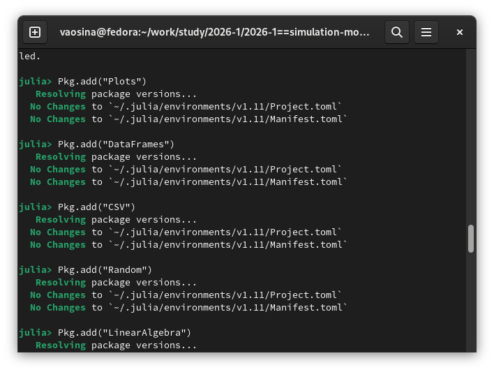{#fig-001 width=70%}

## Инициализирую проект. ([рис. @fig-002]).

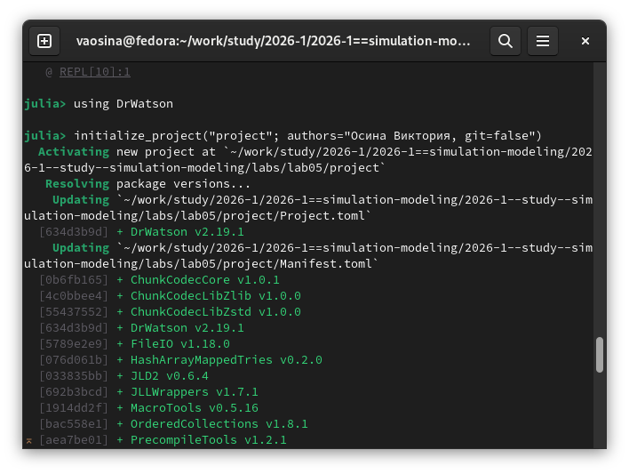{#fig-002 width=70%}

## Созданию файл с кодом модели src/DiningPhilosophers.jl. ([рис. @fig-003]).

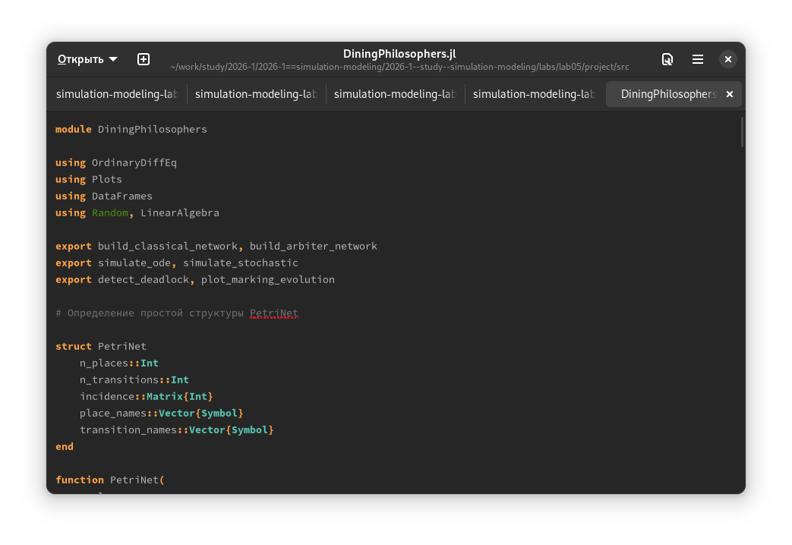{#fig-003 width=70%}

## Создаю файл с кодом базового эксперимента scripts/dining_philosophers.jl, который выполняет основное моделирование и сравнение двух вариантов сети Петри: классическая модель и модифицированная модель с арбитром.([рис. @fig-004]).

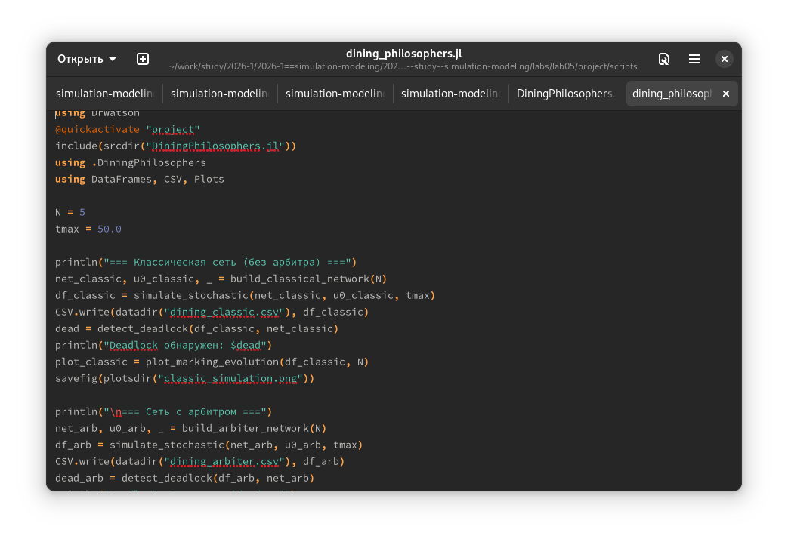{#fig-004 width=70%}

## На выходе получаем консольный вывод с сообщением о том, обнаружен ли deadlock для каждой модели.([рис. @fig-005]).

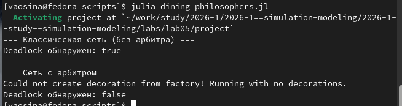{#fig-005 width=70%}

## В результате выполнения кода создались CSV-файлы с полной траекторией состояний (время + количество фишек в каждой позиции). ([рис. @fig-006]).

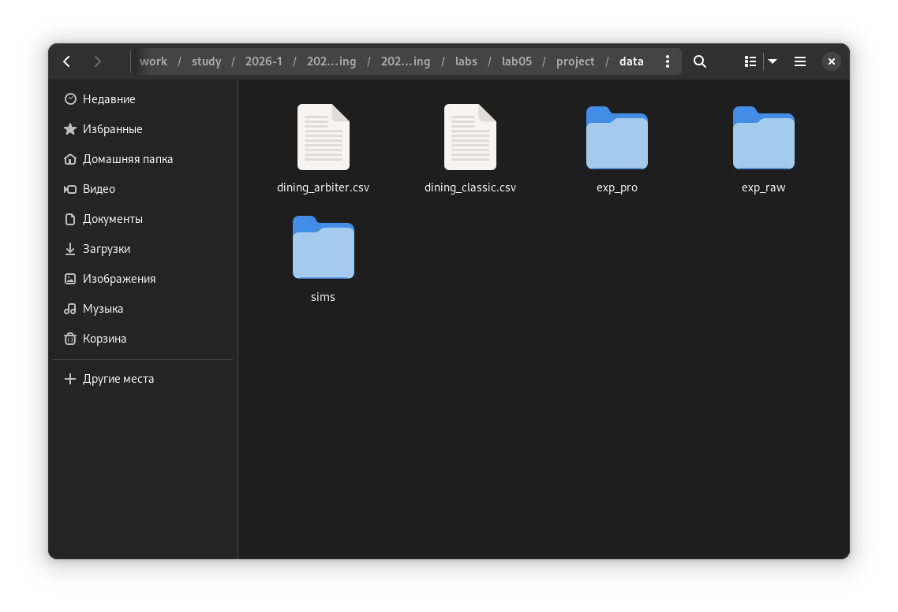{#fig-006 width=70%}

## Также в результате выполнения кода создались графики: четыре панели (Think, Hungry, Eat, Fork) с динамикой для каждого философа. ([рис. @fig-007]).

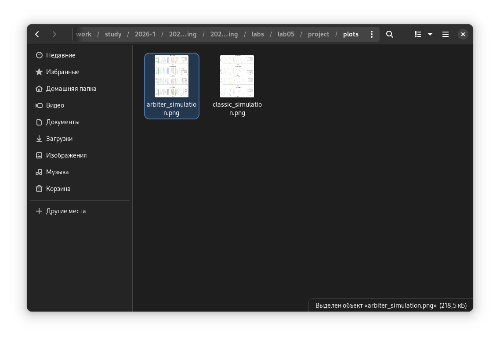{#fig-007 width=70%}

## Аналогично создаю файл scripts/dining_philosophers_animation.jl для наглядной демонстрации динамики работы сети Петри во времени. [рис. @fig-008]).

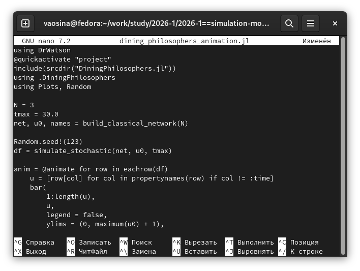{#fig-008 width=70%}

## Консольный вывод. [рис. @fig-009]).

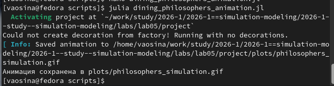{#fig-009 width=70%}

## В результате получили GIF-анимацию. [рис. @fig-010])

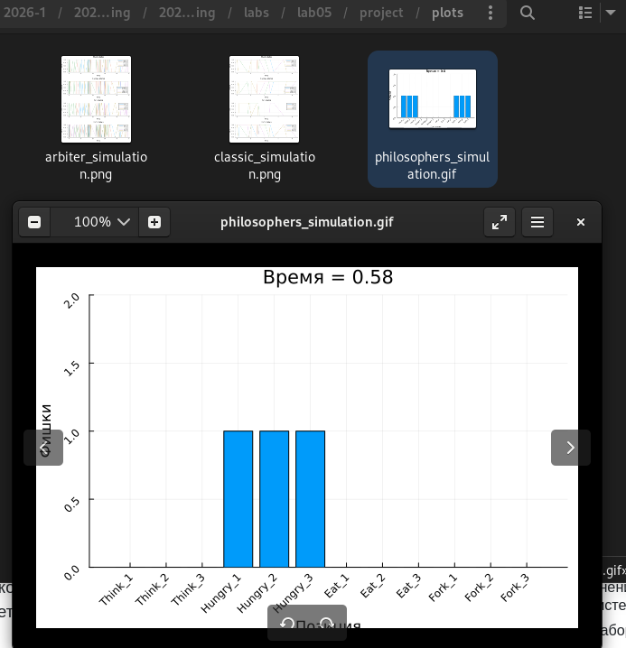{#fig-010 width=70%}

## Теперь создаю файл итогового отчёта scripts/dining_philosophers_report.jl. ([рис. @fig-012]).

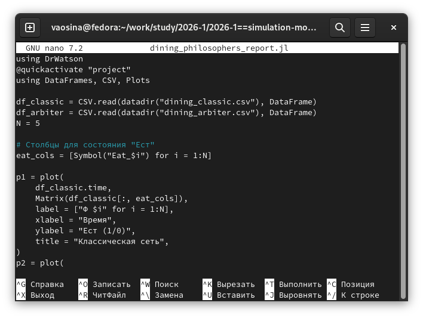{#fig-012 width=70%}

## Консольный вывод. [рис. @fig-013]).

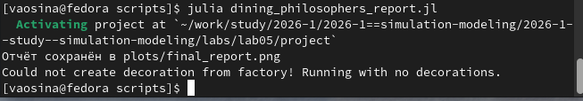{#fig-013 width=70%}

## Созданный в результате выполнения график с двумя панелями. ([рис. @fig-014]).

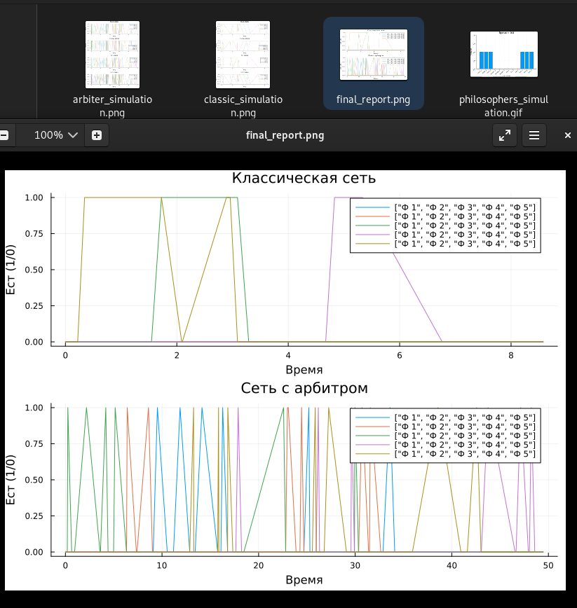{#fig-014 width=70%}

## Генерирую из литературного кода другие форматы ([рис. @fig-015]).

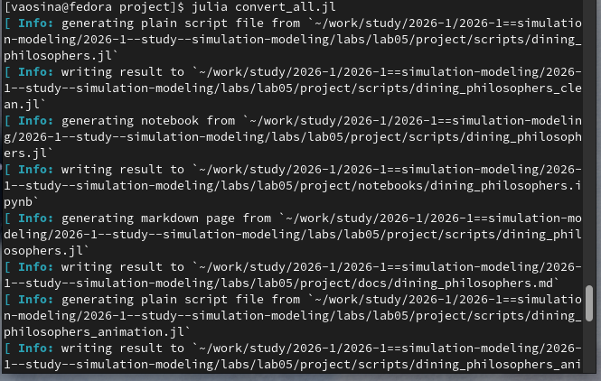{#fig-015 width=70%}

# Результаты генерации: чистый код, jupyter notebook и документацию в формате Quarto. 
## 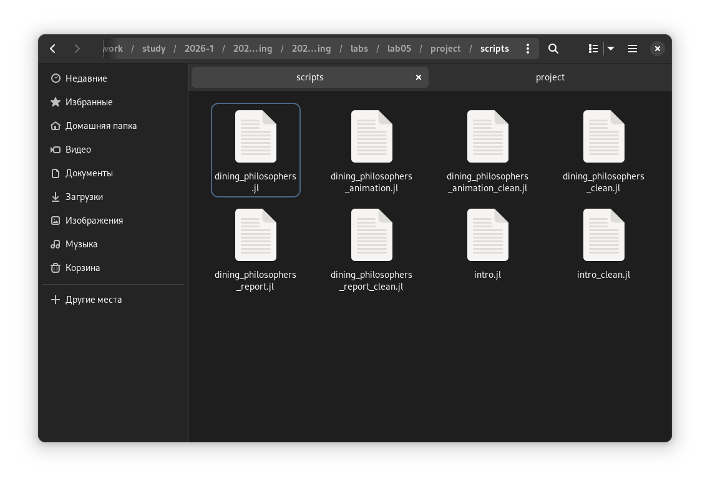{#fig-016 width=70%}

## 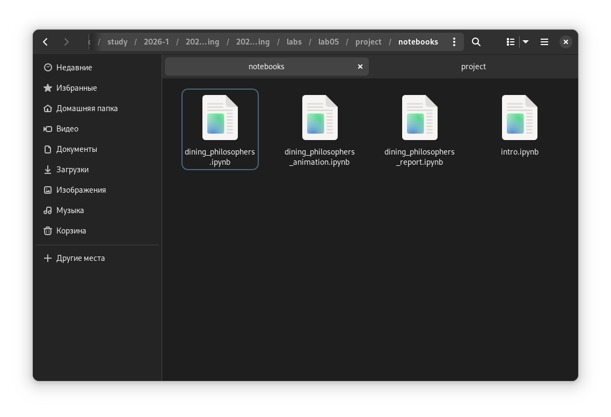{#fig-018 width=70%}

## 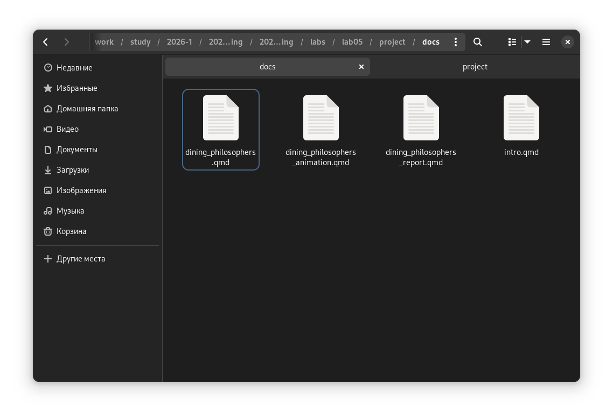{#fig-017 width=70%}

# Результаты выполнения сгенерированных файлов jupyter notebook. 

## 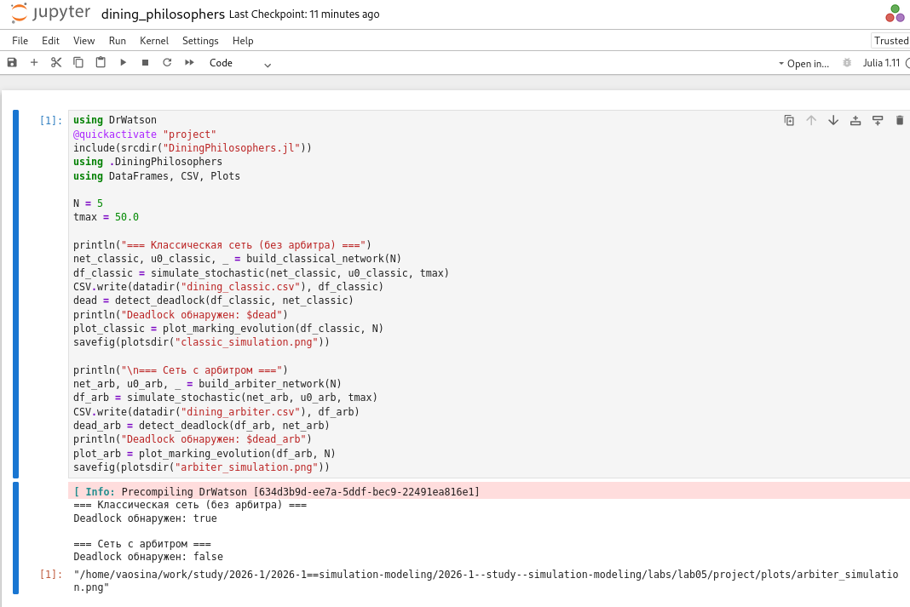{#fig-019 width=70%}

## 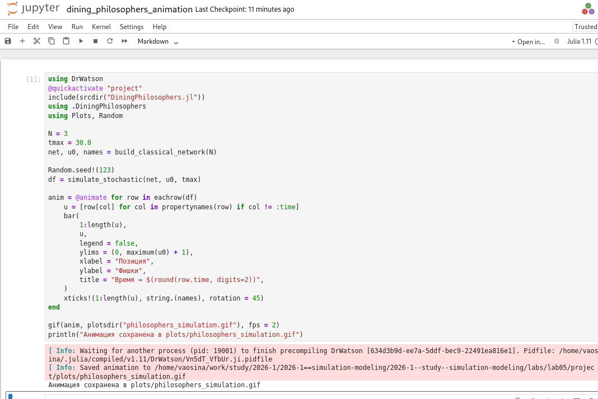{#fig-020 width=70%}

## 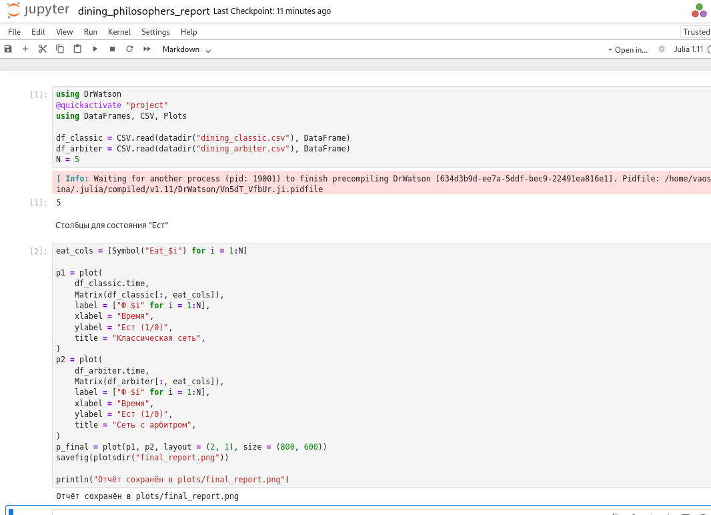{#fig-021 width=70%}

## Выводы

  - Ознакомились с аппаратом сетей Петри, построили сеть Петри для пяти философов, моделируя захват и освобождение вилок.
  - Обнаружили состояние взаимной блокировки (deadlock), когда каждый философ взял одну вилку и ждёт вторую.
  - Провели имитационное моделирование (стохастическое и детерминированное) и выявили наличие deadlock.
  - Модифицировали сеть, чтобы предотвратить deadlock.
  - Проанализировали результаты и оформили отчёт с графиками и анимацией.

