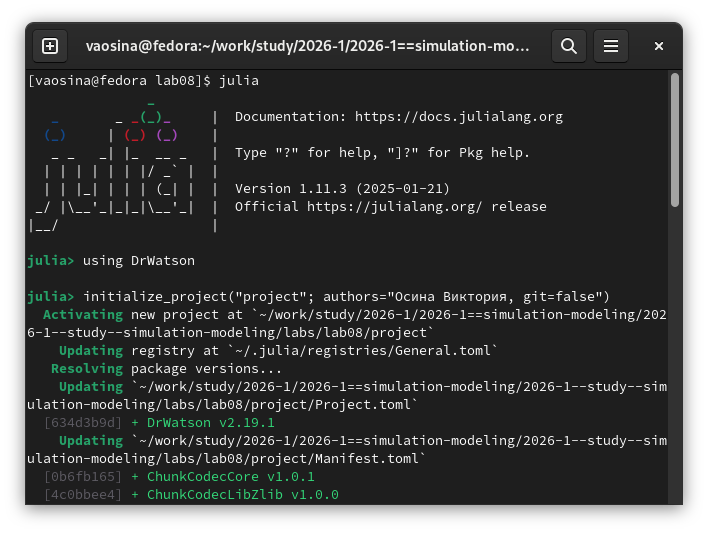
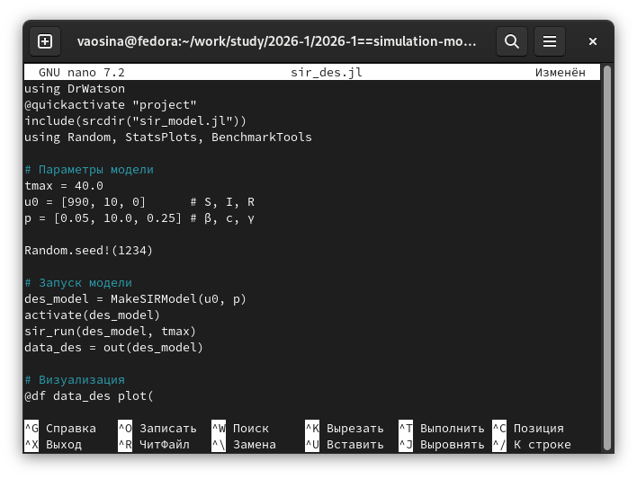
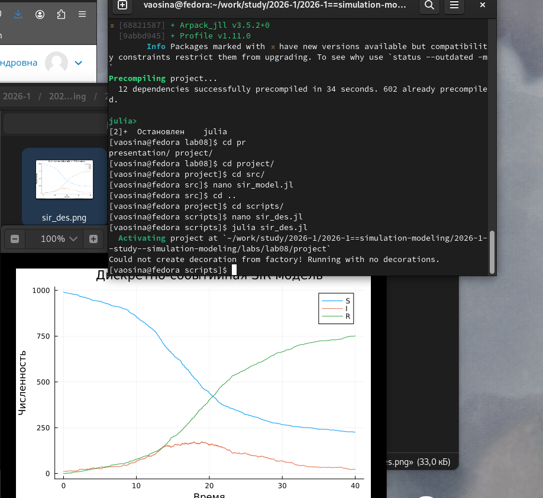
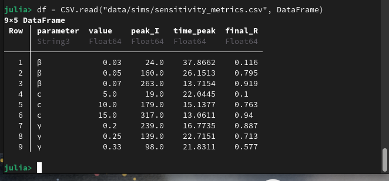
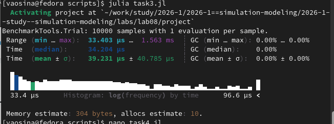
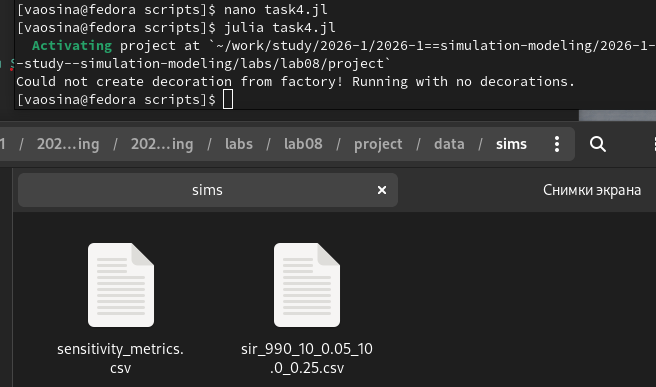
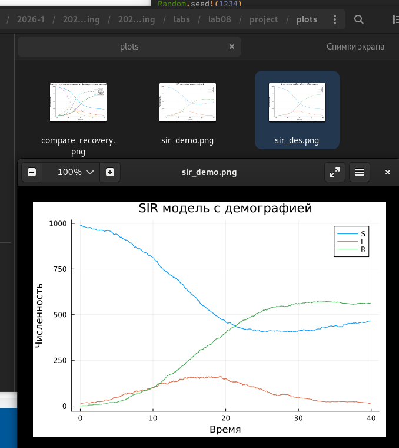
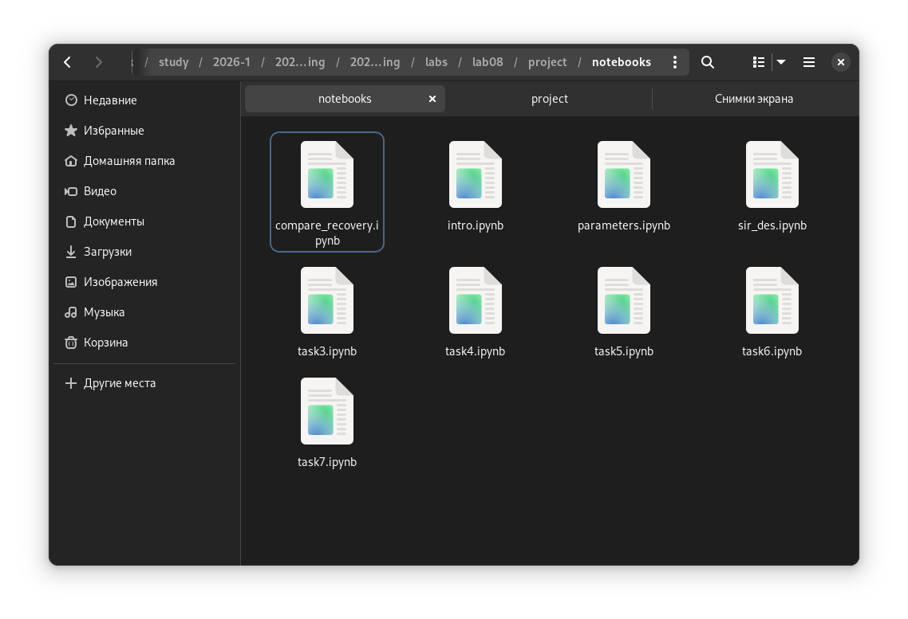

---
## Author
author:
  name: Осина Виктория Александровна
  email: 1132236006rudn.ru
  affiliation:
    - name: Российский университет дружбы народов
      country: Российская Федерация
      postal-code: 117198
      city: Москва
      address: ул. Орджоникидзе д. 3
      
## Title
title: "Презентация по лабораторной работе №8"
subtitle: "Реализация основных моделей в дискретно-событийном подходе"
license: CC BY
date: today
date-format: "2026-05-30" 

format: 
  revealjs:  # для HTML презентации
    theme: beige
    slide-number: true
  beamer:    # для PDF презентации
    theme: metropolis
---
## Докладчик

:::::::::::::: {.columns align=center}
::: {.column width="70%"}

   Осина Виктория Александровна
   
   студент
   
   Российский университет дружбы народов им. П. Лумумбы
   
   [1132236006@rudn.ru]
   
   <https://urocean.github.io>

:::
::: {.column width="30%"}

:::
::::::::::::::

## Актуальность

* Моделирование распространения инфекций помогает понять динамику эпидемий и оценить эффективность мер борьбы. В работе осваивается агентный подход, который учитывает случайность и индивидуальное поведение, что приближает модель к реальности.

## Цель работы

- Изучить дискретно-событийный подход к имитационному моделированию на примере классической модели распространения инфекции SIR. 
- Реализовать стохастическую дискретно-событийную модель в виде программного комплекса на языке Julia.
- Провести анализ влияния параметров, сравнить со стохастической и детерминированной версиями, оценить производительность и модифицировать модель.

# Выполнение лабораторной работы

## Устанавливаю необходимые пакеты. ([рис. @fig-001]).

{#fig-001 width=70%}

## Созданию файл с кодом модели src/sir_model.jl, который реализует вычислительную логику модели. ([рис. @fig-003]).

{#fig-003 width=70%}

## Создаю файл с кодом базового эксперимента scripts/sir_des.jl. Выполняет один базовый эксперимент с фиксированными параметрами β = 0.05,c = 10, γ = 0.25. ([рис. @fig-004]).

{#fig-004 width=70%}

## Запустили базовый прогон, на выходе получили временные ряды.([рис. @fig-005]).

{#fig-005 width=70%}

## В первом задании провели несколько прогонов с разными значениями β, c, γ. Результаты сохранили в датафрейм. ([рис. @fig-007]).

{#fig-007 width=70%}

## Во втором задании мы заменили экспоненциальное время выздоровления на фиксированную величину 1/γ. Отсутствуют «хвосты» распределения и можем видеть более синхронное выздоровление, а также пик I немного выше. [рис. @fig-008]).

{#fig-008 width=70%}

## В 3 задании с помощью макроса @benchmark измерим время выполнения sir_run для популяции 10000 индивидов. В качестве способов оптимизации можно рассмотреть использование векторизованных операций или предварительное генерирование случайных чисел. ([рис. @fig-009]).

{#fig-009 width=70%}

## В 4 задании добавим автоматическое сохранение итоговой таблицы в каталог data/sims/ с уникальным именем, содержащим параметры запуска. ([рис. @fig-010]).

{#fig-010 width=70%}

## В 5 задании расширим модель, добавив в жизненный цикл индивида возможность смерти (с постоянной интенсивностью μ) и рождение новых восприимчивых. ([рис. @fig-011]).

{#fig-011 width=70%}

## В 6 задании реализовали стратегию вакцинации: в определённый момент времени t=5 часть восприимчивых мгновенно переводится в :R.([рис. @fig-012]).

{#fig-012 width=70%}

## В 7 задании ввели латентный период (статус :E). С введение латентного периода эпидемия развивается медленнее, а также ниже пик заболевших людей. [рис. @fig-013]).

{#fig-013 width=70%}

## Генерирую из литературного кода другие форматы ([рис. @fig-014]).

{#fig-014 width=70%}

# Результаты генерации: чистый код, jupyter notebook и документацию в формате Quarto. 
## {#fig-015 width=70%}

## {#fig-016 width=70%}

## {#fig-017 width=70%}

# Результаты выполнения одного из сгенерированных файлов jupyter notebook.

## {#fig-018 width=70%}

## Выводы

- Изучили дискретно-событийный подход к имитационному моделированию на примере классической модели распространения инфекции SIR. 
- Реализовали стохастическую дискретно-событийную модель в виде программного комплекса на языке Julia.
- Провели анализ влияния параметров, сравнили со стохастической и детерминированной версиями, оценили производительность и модифицировали модель.

