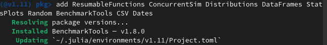
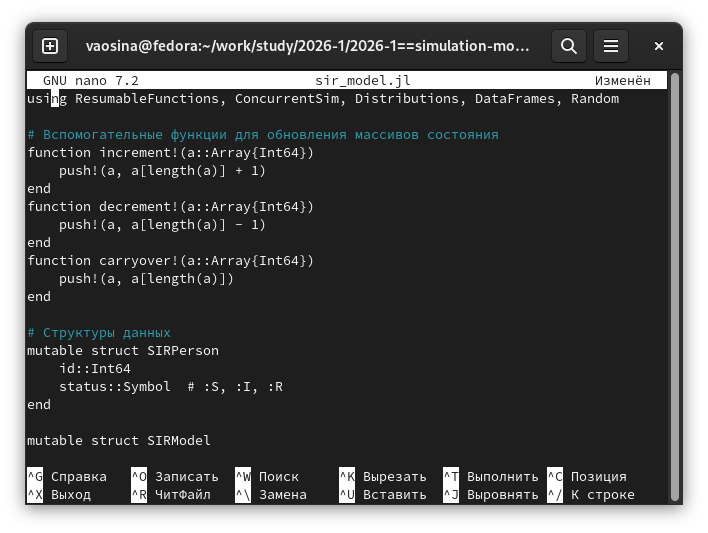
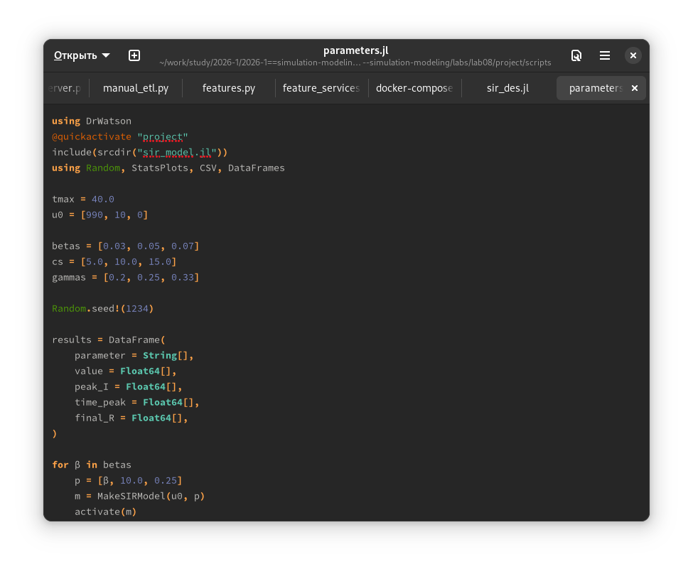
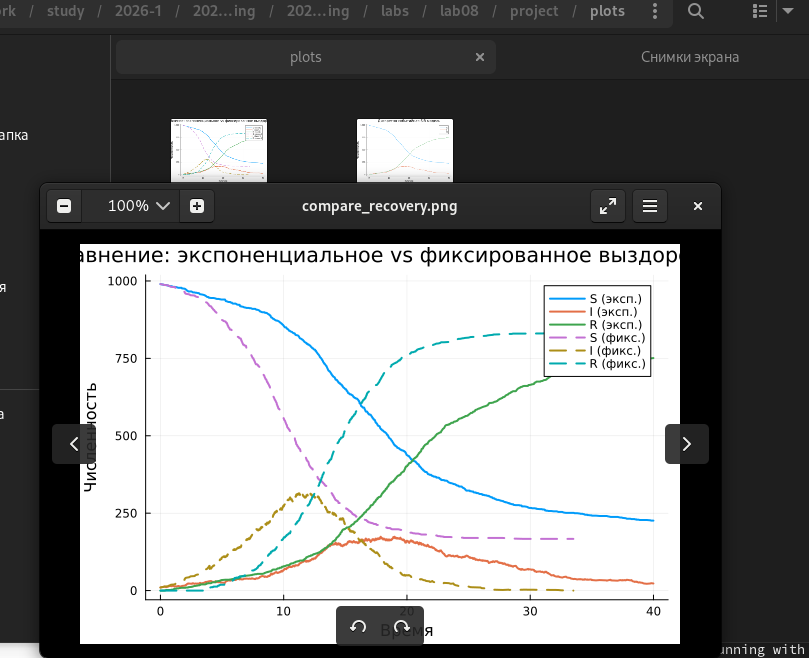
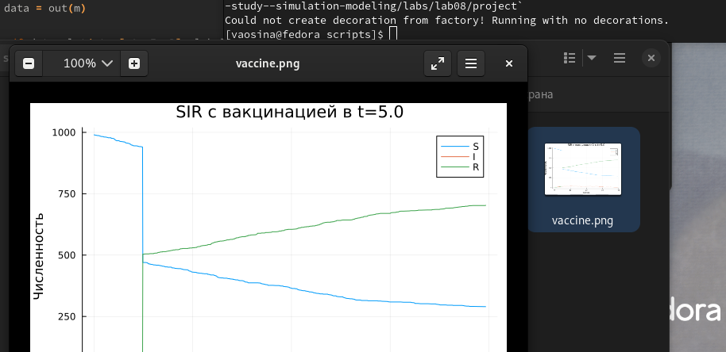
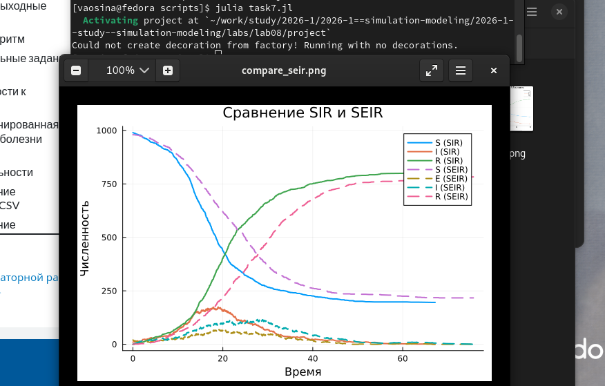
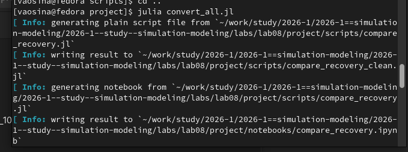
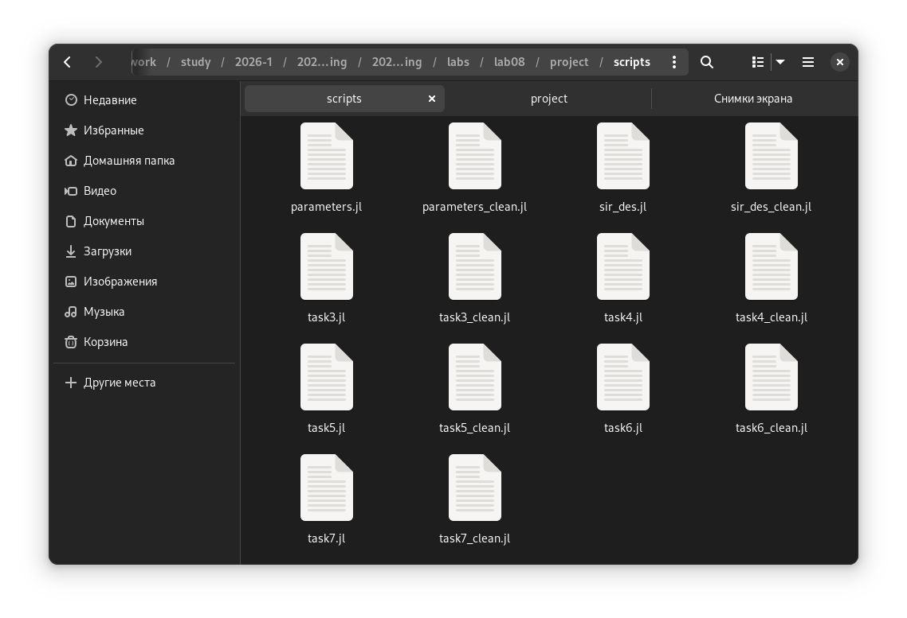
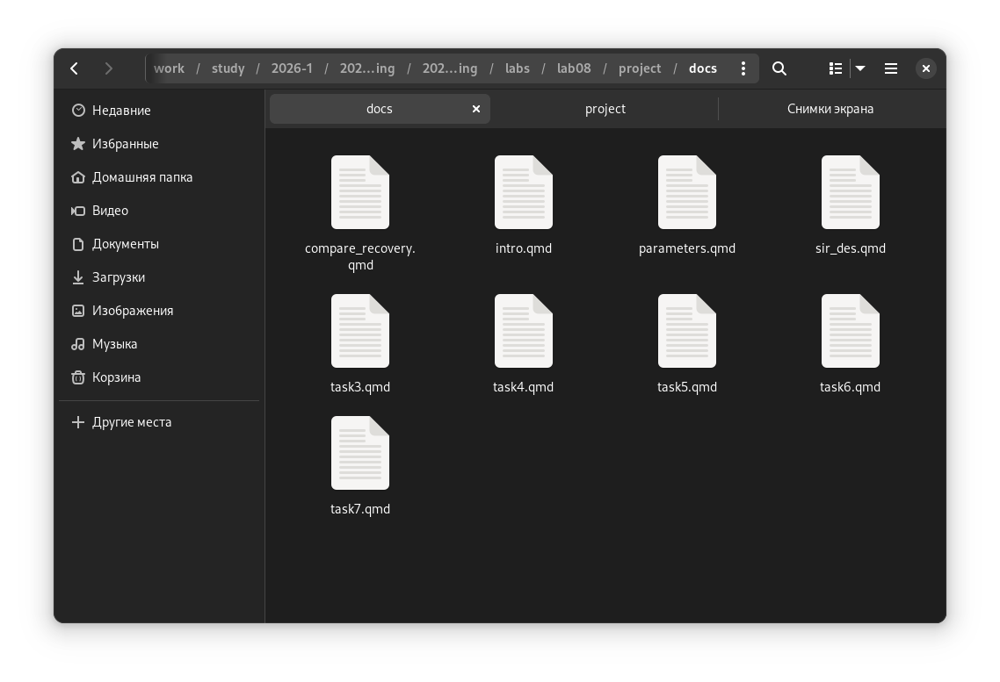
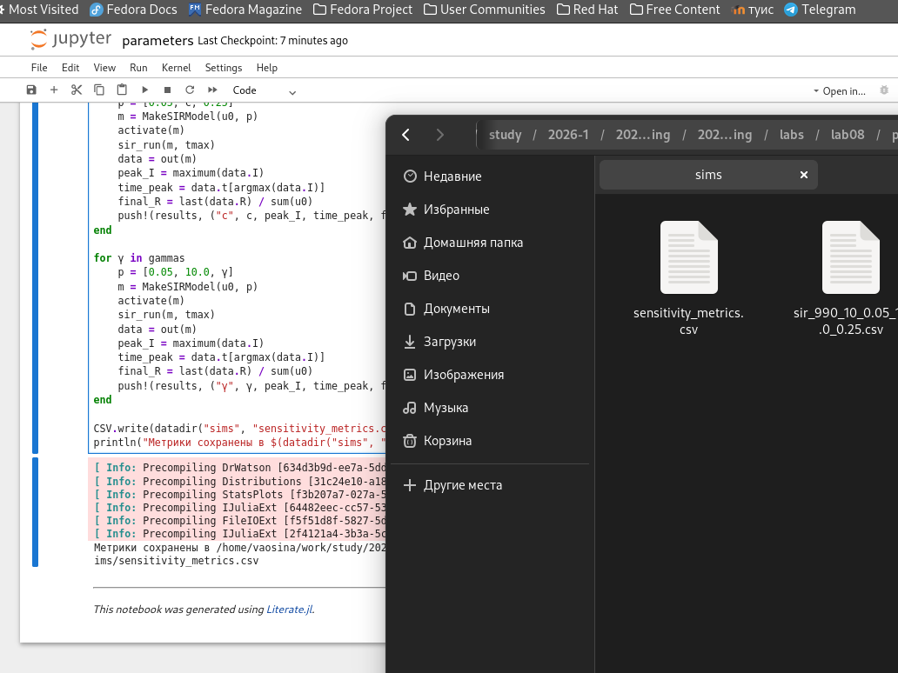

---
## Author
author:
  name: Осина Виктория Александровна
  email: 1132236006rudn.ru
  affiliation:
    - name: Российский университет дружбы народов
      country: Российская Федерация
      postal-code: 117198
      city: Москва
      address: ул. Орджоникидзе д. 3

## Title
title: "Отчёт по лабораторной работе №8"
subtitle: "Реализация основных моделей в дискретно-событийном подходе"
license: "CC BY"
---

# Цель работы

- Изучить дискретно-событийный подход к имитационному моделированию на примере классической модели распространения инфекции SIR. 
- Реализовать стохастическую дискретно-событийную модель в виде программного комплекса на языке Julia.
- Провести анализ влияния параметров, сравнить со стохастической и детерминированной версиями, оценить производительность и модифицировать модель.

# Задание

   * Создать рабочий каталог для кода.
   * Установить необходимые пакеты.
   * Выполнить предложенный код.
   * Преобразовать код в литературный стиль.
   * Сгенерировать из литературного кода:
       - чистый код;
       - jupyter notebook;
       - документацию в формате Quarto.
   * Выполнить код из jupyter notebook.
   * Интегрировать документацию в формате Quarto в отчёт.
   * Добавить в код в литературном стиле вычисление для набора параметров.
   * Сгенерировать из литературного кода с параметрами:
       - чистый код;
       - jupyter notebook;
       - документацию в формате Quarto.
   * Выполнить код из jupyter notebook с параметрами.
   * Интегрировать документацию с параметрами в формате Quarto в отчёт.

# Теоретическое введение

Программа моделирует стохастическое распространение инфекции в полностью смешивающейся популяции конечного размера. В отличие от детерминированной системы ОДУ, здесь наблюдаются случайные флуктуации, а также возможны ранние вымирания от инфекции при малых начальных I.

    Инициализация: создание объектов индивидов с начальными статусами, инициализация статистических массивов.
    Планирование процессов: для каждого индивида создаётся параллельный процесс (@process), реализующий его жизненный цикл.
    Запуск симуляции: ConcurrentSim.run продвигает виртуальное время, обрабатывая события в хронологическом порядке. Каждый timeout добавляет событие в календарь; когда время события наступает, выполняется соответствующий код внутри live (возможно, порождая новые события).
    Сбор статистики: в момент изменения состояния индивида обновляются временные ряды Sa, Ia, Ra, а также запоминается текущее время.
    Завершение: по достижении tf симуляция останавливается. Все накопленные ряды экспортируются в таблицу.
    Постобработка: построение графиков, сохранение результатов.

# Выполнение лабораторной работы

Инициализирую проект. ([рис. @fig-001]).

{#fig-001 width=70%}

Устанавливаю необходимые пакеты. ([рис. @fig-002]).

{#fig-002 width=70%}

Созданию файл с кодом модели src/sir_model.jl, который реализует вычислительную логику модели. ([рис. @fig-003]).

{#fig-003 width=70%}

Создаю файл с кодом базового эксперимента scripts/sir_des.jl. Выполняет один базовый эксперимент с фиксированными параметрами β = 0.05,c = 10, γ = 0.25. ([рис. @fig-004]).

{#fig-004 width=70%}



Запустили базовый прогон, на выходе получили временные ряды.([рис. @fig-005]).

{#fig-005 width=70%}

Создаем скрипт для 1 задания, где мы будем перебирать параметры. ([рис. @fig-006]).

{#fig-006 width=70%}



Провели несколько прогонов с разными значениями β, c, γ. Результаты сохранили в датафрейм. Увеличение бета увеличило и ускорило наступление пика количества заболевших и итоговая доля переболевших при этом стремится к 1. Увеличение параметра с также увеличивает пик заболевших, однако уже не настолько сильно и также растет итоговая доля переболевших. Увеличение параметра гамма (снижение времени болезни) уменьшает пик и общее количество заболевших а так уменьшает долю переболевших. ([рис. @fig-007]).

{#fig-007 width=70%}

Во втором задании мы заменили экспоненциальное время выздоровления на фиксированную величину 1/γ. В результате выполнения скрипта получили график сравнения со стохастической версией. Отсутствуют «хвосты» распределения и может видеть более синхронное выздоровление, а также пик I немного выше. [рис. @fig-008]).

{#fig-008 width=70%}



В 3 задании с помощью макроса @benchmark измерим время выполнения sir_run для популяции 10000 индивидов.
В результате можем видеть, что время выполнения прогона для популяции 10000 индивидов достаточно маленькое и каждый прогон занимает примерно 30-40 микросекунд. Однако в качестве способов оптимизации можно дополнительно рассмотреть использование векторизованных операций или предварительное генерирование случайных чисел. ([рис. @fig-009]).

{#fig-009 width=70%}



В 4 задании добавим автоматическое сохранение итоговой таблицы в каталог data/sims/ с уникальным именем, содержащим параметры запуска. ([рис. @fig-010]).

{#fig-010 width=70%}



В 5 задании расширим модель, добавив в жизненный цикл индивида возможность смерти (с постоянной интенсивностью μ) и рождение новых восприимчивых. Смерть удаляет индивида из популяции, рождение добавляет нового в состояние :S. Это позволяет исследовать эндемическое равновесие. ([рис. @fig-011]).

{#fig-011 width=70%}



В 6 задании реализовали стратегию вакцинации: в определённый момент времени t=5 часть восприимчивых мгновенно переводится в :R.([рис. @fig-012]).

{#fig-012 width=70%}



В 7 задании ввели латентный период (статус :E). После заражения индивид переходит в :E и через время, распределённое экспоненциально с параметром σ, становится инфекционным (:I). С введение латентного периода эпидемия развивается медленнее, а также ниже пик заболевших людей. [рис. @fig-013]).



{#fig-013 width=70%}

Генерирую из литературного кода другие форматы ([рис. @fig-014]).

{#fig-014 width=70%}

Результаты генерации: чистый код, jupyter notebook и документацию в формате Quarto. ([рис. @fig-015]), ([рис. @fig-016]), ([рис. @fig-017]).

{#fig-015 width=70%}

{#fig-016 width=70%}

{#fig-017 width=70%}

Результаты выполнения одного из сгенерированных файлов jupyter notebook. ([рис. @fig-018])

{#fig-018 width=70%}

# Выводы

- Изучили дискретно-событийный подход к имитационному моделированию на примере классической модели распространения инфекции SIR. 
- Реализовали стохастическую дискретно-событийную модель в виде программного комплекса на языке Julia.
- Провели анализ влияния параметров, сравнили со стохастической и детерминированной версиями, оценили производительность и модифицировали модель.

# Список литературы

1. [ТУИС](https://esystem.rudn.ru/mod/resource/view.php?id=1356134)
